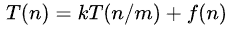

## Divide and Conquer （D&C）  
[code](https://github.com/wan-h/BrainpowerCode/blob/master/AlgorithmCode/README.md)  

---
### OVERVIEW  
分治法是一种递归式的解决方法，其基本思想是将一个复杂问题分割成一些独立的规模较小的问题，分而治之。  
分治法的基本步骤：  
1. 分解：将原问题分解为若干个规模较小，相互独立，与原问题形式相同的子问题  
2. 解决：若子问题规模较小而容易被解决则直接解，否则递归地解各个子问题  
3. 将各个子问题的解合并为原问题的解  

在代码实现上，通过递归的方式解决子问题，递归函数则由两部分组成：  
1. 基线条件（不再调用自己的条件，避免形成死循环）  
2. 递归条件（函数调用本身的条件）  

所以在代码实现时首先明确子问题然后明确递归的基线条件和递归条件，最后递归自身通过函数栈的形式实现合并。  

分治法将规模为n的问题分成k个规模为n/m的子问题去解。且最小子解规模为1的问题消耗一个单位时间。
设将原问题分解为k个子问题以及用merge将K个子问题的解合并为原问题的解需用f(n)个单位时间，
用T(n)表示该分治法解规模为|P|=n的问题所需的计算时间：  
