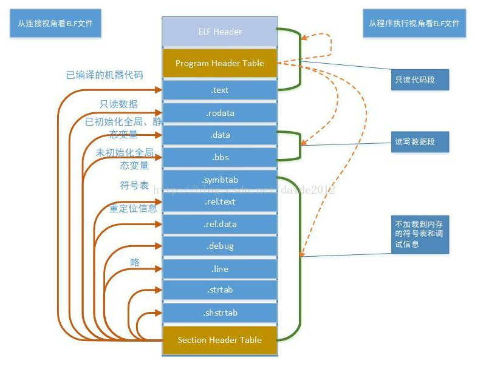
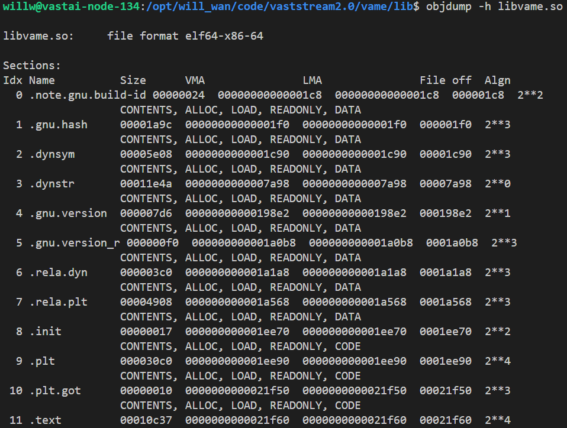
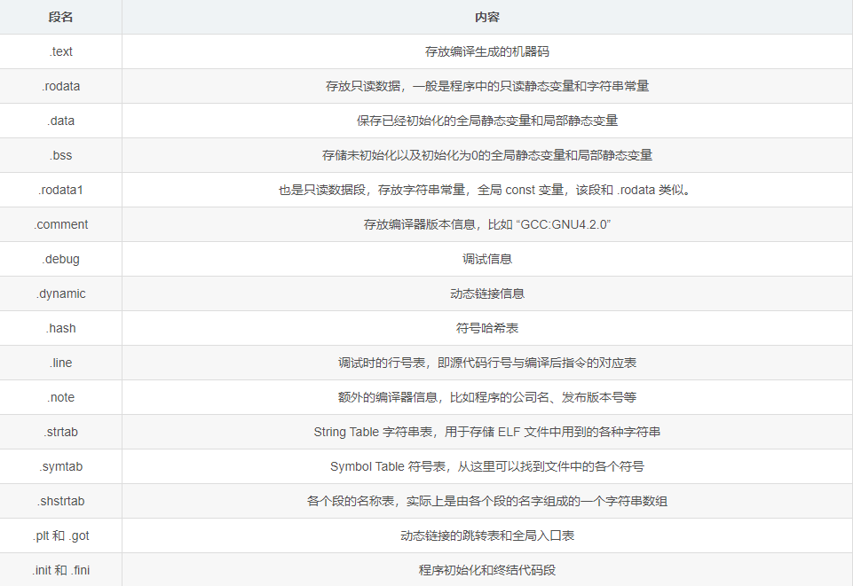
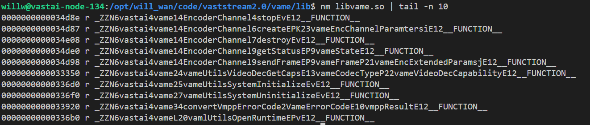

## ELF
### 概述
C++编译生成的二进制文件、可执行文件、目标文件、共享库和核心转储文件基本都是用ELF进行存储的，解析ELF文件格式有助于理解编译过程  
### 文件格式
#### 整体结构 
* 由表头和各个段组成 
* 程序执行时只有数据段和代码段会加载到内存当中
  
#### 各个段定义
* 查看ELF文件包含哪些段  
  
* 常见段的含义  
  
* 查看表内容  
  
* 查看symbol表  
  
#### 链接的过程
在链接中将函数和变量统称为符号，函数名或变量名就是符号名，整个链接过程的核心就是根据符号来确定正确的地址，每一个目标文件都会有一个相应的符号表，记录了目标文件所用到的所有符号，所以有时候在编译代码报未定义的时候，可以通过符号表来查找一下是不是没有这个符号
```bash
# strings会将二进制文件中的字符串抓出来，这里用上面的nm也可以
strings ***.so | grep printf
```
