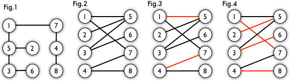
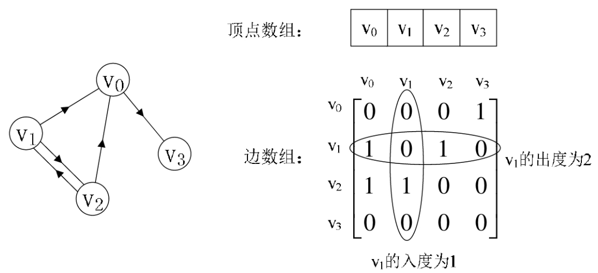

## Graph
### OVERVIEW  
#### 定义
图是由顶点的有穷非空集合和顶点之间边的集合组成，通常表示为: G（V，E），其中，G表示一个图，V是图G中顶点的集合，E是图G中边的集合。  
#### 基本概念  
* 无向图  
如果图中任意两个顶点之间的边都是无向边（简而言之就是没有方向的边），则称该图为无向图（Undirected graphs）  
* 有向图  
如果图中任意两个顶点之间的边都是有向边（简而言之就是有方向的边），则称该图为有向图（Directed graphs）  
* 完全图  
无向完全图：在无向图中，如果任意两个顶点之间都存在边，则称该图为无向完全图。（含有n个顶点的无向完全图有(n×(n-1))/2条边）  
有向完全图：在有向图中，如果任意两个顶点之间都存在方向互为相反的两条边，则称该图为有向完全图。（含有n个顶点的有向完全图有n×(n-1)条边）  
* 二分图  
顶点可以被分成两个不相交的集合，并且同属一个集合内的点两两不相连。这也就是说，如果一个图是二分图，那么它要么没有圈，要么圈所包含的边的数量必定是偶数。  
以下Fig1、Fig2为同一个二分图：  
  
* 匹配  
任意两条不共点的边的组合就是一个匹配，这些边称为匹配边，匹配边所连接的点则被称为匹配点。对于一个二分图来说，可能有很多种匹配。
如果二分图里的某一个匹配包含的边的数量，在该二分图的所有匹配中最大，那么这个匹配称为最大匹配，如二分图中的Fig4。
如果一条路径的首尾是非匹配点，路径中除此之外（如果有）其他的点均是匹配点，那么这条路径就是一条增广路径。  
8->4->7->1->5->2 是一条增广路径。因为 8 和 2 作为路径的首尾是非匹配点，而路径中剩余的 4/7/1/5 均是匹配点。
如果一个图的某个匹配中，所有的顶点都是匹配点，那么它就是一个完美匹配。  
* 度  
顶点Vi的度（Degree）是指在图中与Vi相关联的边的条数。对于有向图来说，有入度（In-degree）和出度（Out-degree）之分，有向图顶点的度等于该顶点的入度和出度之和。  
* 邻接  
若无向图中的两个顶点V1和V2存在一条边(V1,V2)，则称顶点V1和V2邻接（Adjacent）  
若有向图中存在一条边<V3,V2>，则称顶点V3与顶点V2邻接，且是V3邻接到V2或V2邻接直V3  
* 路径  
在无向图中，若从顶点Vi出发有一组边可到达顶点Vj，则称顶点Vi到顶点Vj的顶点序列为从顶点Vi到顶点Vj的路径（Path）  
* 连通  
若从Vi到Vj有路径可通，则称顶点Vi和顶点Vj是连通（Connected）的  
* 权  
有些图的边或弧具有与它相关的数字，这种与图的边或弧相关的数叫做权（Weight）  

#### 图的存储结构  
图可以使用邻接矩阵的方式进行存储，邻接矩阵存储方式是用两个数组来表示图。一个一维数组存储图中顶点信息，一个二维数组（称为邻接矩阵）存储图中的边或弧的信息。
设图G有n个顶点，则邻接矩阵是一个nxn的方阵，其表现形式如下：  
  

---
### 相关算法  
* 解决无权图路径相关问题  
路径最短问题：[广度优先搜索（BFS）](https://github.com/wan-h/Brainpower/blob/master/Code/CS/DataStructure/Graph/BFS_DFS.py)  
路径最长问题：[深度优先搜索（DFS）](https://github.com/wan-h/Brainpower/blob/master/Code/CS/DataStructure/Graph/BFS_DFS.py)  
* 解决有权图路径相关问题  
路径最快问题：[狄克斯特拉算法](https://github.com/wan-h/Brainpower/blob/master/Code/CS/DataStructure/Graph/dijkstra.py) （针对有向无环图）   
狄克斯特拉算法不能用于包含负权值的图，含负权值图使用[贝尔曼-福德算法(Bellman ford)](https://github.com/wan-h/Brainpower/blob/master/Code/CS/DataStructure/Graph/bellman_fold.py)  
* 解决二分图匹配问题  
最大匹配：[匈牙利算法](https://github.com/wan-h/Brainpower/blob/master/Code/CS/DataStructure/Graph/hungary.py)