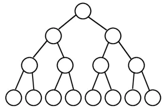

## Tree
### OVERVIEW  
#### 定义
树是由顶点和边组成且不存在任何环的一种数据结结构。
#### 基本概念  
* 二叉树
每个结点至多拥有两棵子树，并且二叉树的子树有左右之分，其次序不能任意颠倒。  
  

---
### 相关算法  
* 二叉树  
[二叉树的遍历](https://github.com/wan-h/Brainpower/blob/master/Code/CS/DataStructure/Tree/traverse.py)