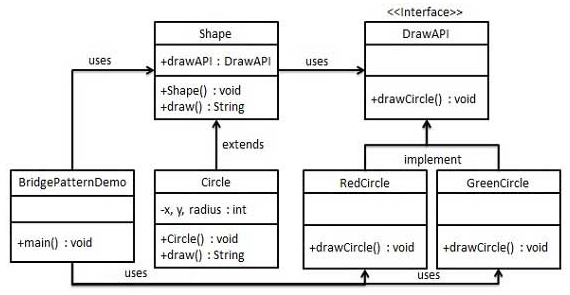

## Bridge Pattern
[Insight](https://www.runoob.com/design-pattern/bridge-pattern.html)  
[code](https://github.com/wan-h/BrainpowerCode/blob/master/DesignPatterns/BridgePattern.py)

---
### Overview  
* 意图  
将抽象部分与实现部分分离，使它们都可以独立的变化。

* 主要解决  
在有多种可能会变化的情况下，用继承会造成类爆炸问题，扩展起来不灵活。

* 何时使用  
实现系统可能有多个角度分类，每一种角度都可能变化。

* 如何解决  
把这种多角度分类分离出来，让它们独立变化，减少它们之间耦合。

* 关键代码  
抽象类依赖实现类。

* 应用实例  
1、墙上的开关，可以看到的开关是抽象的，不用管里面具体怎么实现的。

* 优点  
1、抽象和实现的分离。   
2、优秀的扩展能力。   
3、实现细节对客户透明。   

* 缺点  
1、桥接模式的引入会增加系统的理解与设计难度，由于聚合关联关系建立在抽象层，要求开发者针对抽象进行设计与编程。

* 使用场景  
1、如果一个系统需要在构建的抽象化角色和具体化角色之间增加更多的灵活性，避免在两个层次之间建立静态的继承联系，
通过桥接模式可以使它们在抽象层建立一个关联关系。  
2、对于那些不希望使用继承或因为多层次继承导致系统类的个数急剧增加的系统，桥接模式尤为适用。  
3、一个类存在两个独立变化的维度，且这两个维度都需要进行扩展。

* 注意事项  
对于两个独立变化的维度，使用桥接模式再适合不过了。

---
### UML  
有一个作为桥接实现的 DrawAPI 接口和实现了 DrawAPI 接口的实体类 RedCircle、GreenCircle。Shape 是一个抽象类，
将使用 DrawAPI 的对象。BridgePatternDemo，演示类使用 Shape 类来画出不同颜色的圆。  
  

---
### Intuition  
将具体实现类传给抽象类提供实现的方法从而保持抽象类和实现类的解耦独立。