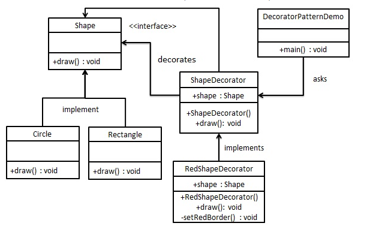

## Decorator Pattern
[Insight](https://www.runoob.com/design-pattern/decorator-pattern.html)  
[code](https://github.com/wan-h/BrainpowerCode/blob/master/DesignPatterns/DecoratorPattern.py)

---
### Overview  
* 意图  
动态地给一个对象添加一些额外的职责。就增加功能来说，装饰器模式相比生成子类更为灵活。

* 主要解决  
一般的，我们为了扩展一个类经常使用继承方式实现，由于继承为类引入静态特征，
并且随着扩展功能的增多，子类会很膨胀。

* 何时使用  
在不想增加很多子类的情况下扩展类。

* 如何解决  
将具体功能职责划分，同时继承装饰者模式。

* 关键代码  
1、Component 类充当抽象角色，不应该具体实现。   
2、修饰类引用和继承 Component 类，具体扩展类重写父类方法。

* 应用实例  
1、不论一幅画有没有画框都可以挂在墙上，但是通常都是有画框的，并且实际上是画框被挂在墙上。
在挂在墙上之前，画可以被蒙上玻璃，装到框子里；这时画、玻璃和画框形成了一个物体。

* 优点  
1、装饰类和被装饰类可以独立发展，不会相互耦合，装饰模式是继承的一个替代模式，
装饰模式可以动态扩展一个实现类的功能。 

* 缺点  
1、多层装饰比较复杂。

* 使用场景  
1、扩展一个类的功能。   
2、动态增加功能，动态撤销。

* 注意事项  
可代替继承。

---
### UML  
创建一个 Shape 接口和实现了 Shape 接口的实体类。然后我们创建一个实现了 Shape 接口的抽象装饰类 ShapeDecorator，
并把 Shape 对象作为它的实例变量。RedShapeDecorator 是实现了 ShapeDecorator 的实体类。
演示类使用 RedShapeDecorator 来装饰 Shape 对象。 
  

---
### Intuition  
装饰类向一个现有的被装饰类提供额外的功能，两者可以解耦独立维护，避免引入过多的子类。