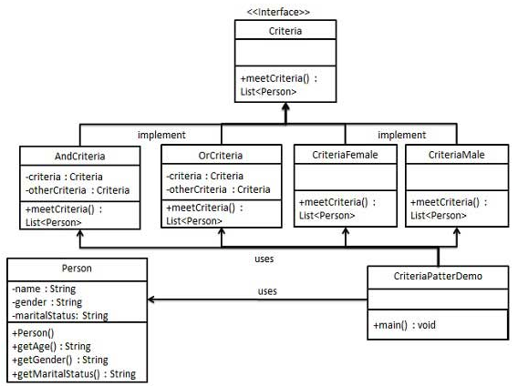

## Filter Pattern
[Insight](https://www.runoob.com/design-pattern/filter-pattern.html)  
[code](https://github.com/wan-h/BrainpowerCode/blob/master/DesignPatterns/FilterPattern.py)

---
### Overview  
过滤器模式（Filter Pattern）或标准模式（Criteria Pattern）允许开发人员使用不同的标准来过滤一组对象，
通过逻辑运算以解耦的方式把它们连接起来。这种类型的设计模式属于结构型模式，它结合多个标准来获得单一标准。

---
### UML  
创建一个 Person 对象、Criteria 接口和实现了该接口的实体类，来过滤 Person 对象的列表。
CriteriaPatternDemo，演示类使用 Criteria 对象，基于各种标准和它们的结合来过滤 Person 对象的列表。
  

---
### Intuition  
构建过滤器类来过滤满足条件的对象，并通过过滤器的组合实现组合的过滤机制。