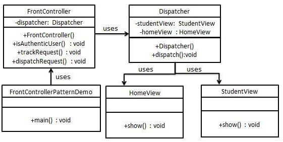

## Front Controller Pattern
[Insight](https://www.runoob.com/design-pattern/front-controller-pattern.html)  
[code](../../../Code/CS/DesignPatterns/FrontControllerPattern.py)

---
### Overview  
前端控制器模式（Front Controller Pattern）是用来提供一个集中的请求处理机制，所有的请求都将由一个单一的处理程序处理。
该处理程序可以做认证/授权/记录日志，或者跟踪请求，然后把请求传给相应的处理程序。以下是这种设计模式的实体。  

* 前端控制器（Front Controller） - 处理应用程序所有类型请求的单个处理程序，应用程序可以是基于 web 的应用程序，
也可以是基于桌面的应用程序。  
* 调度器（Dispatcher） - 前端控制器可能使用一个调度器对象来调度请求到相应的具体处理程序。  
* 视图（View） - 视图是为请求而创建的对象。

---
### UML  
创建 FrontController、Dispatcher 分别当作前端控制器和调度器。
HomeView 和 StudentView 表示各种为前端控制器接收到的请求而创建的视图。
演示类使用 FrontController 来演示前端控制器设计模式。  
  

---
### Intuition  
前端控制模式在前端应用上非常经典，通过调度器来对所有请求进行统一管理从而方便日志管理等维护。