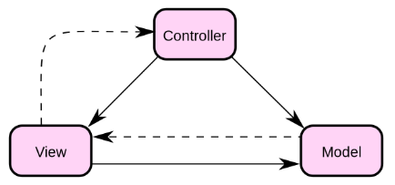
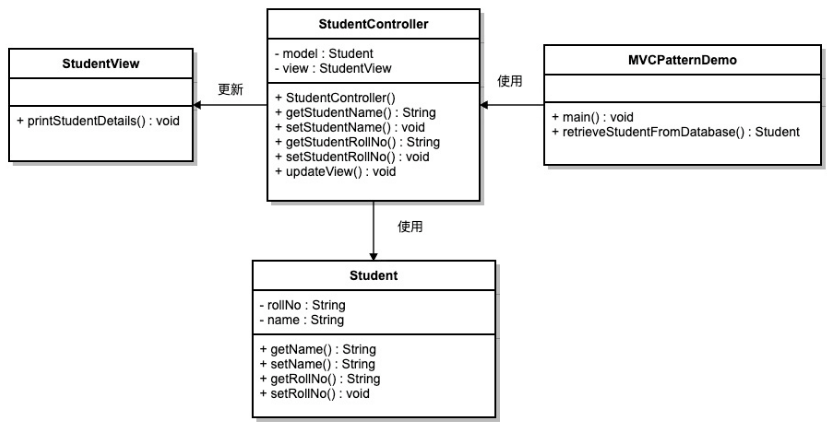

## Model View Controller Pattern
[Insight](https://www.runoob.com/design-pattern/mvc-pattern.html)  
[code](https://github.com/wan-h/BrainpowerCode/blob/master/DesignPatterns/ModelViewControllerPattern.py)

---
### Overview  
MVC 模式代表 Model-View-Controller（模型-视图-控制器） 模式。这种模式用于应用程序的分层开发。  
   
* Model（模型） - 模型代表一个存取数据的对象或 JAVA POJO。它也可以带有逻辑，在数据变化时更新控制器。  
* View（视图） - 视图代表模型包含的数据的可视化。  
* Controller（控制器） - 控制器作用于模型和视图上。它控制数据流向模型对象，并在数据变化时更新视图。它使视图与模型分离开。

---
### UML  
创建一个作为模型的 Student 对象。StudentView 是一个把学生详细信息输出到控制台的视图类，StudentController 是负责存储数据到 Student 
对象中的控制器类，并相应地更新视图 StudentView。演示类使用 StudentController 来演示 MVC 模式的用法。  
  

---
### Intuition  
Controller控制model并保持view的更新，主要将模型与视图分离开。