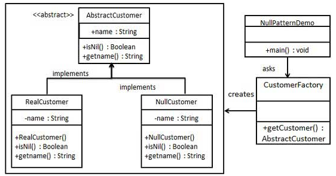

## Null Object Pattern
[Insight](https://www.runoob.com/design-pattern/null-object-pattern.html)  
[code](https://github.com/wan-h/BrainpowerCode/blob/master/DesignPatterns/NullObjectPattern.py)

---
### Overview  
在空对象模式（Null Object Pattern）中，一个空对象取代 NULL 对象实例的检查。Null 对象不是检查空值，而是反应一个不做任何动作的关系。
这样的 Null 对象也可以在数据不可用的时候提供默认的行为。
在空对象模式中，我们创建一个指定各种要执行的操作的抽象类和扩展该类的实体类，还创建一个未对该类做任何实现的空对象类，
该空对象类将无缝地使用在需要检查空值的地方。

---
### UML  
创建一个定义操作的 AbstractCustomer 抽象类，和扩展了 AbstractCustomer 类的实体类。
工厂类 CustomerFactory 基于客户传递的名字来返回 RealCustomer 或 NullCustomer 对象。
NullPatternDemo演示类使用 CustomerFactory 来演示空对象模式的用法。  
  

---
### Intuition  
类似于python中defaultDict的概念，保证空对象不是抛出错误而是返回一个默认的对象。