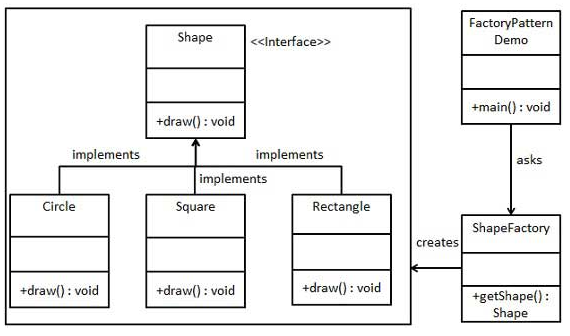

## Simple Factory Pattern
[Insight](https://www.runoob.com/design-pattern/factory-pattern.html)  
[code](https://github.com/wan-h/BrainpowerCode/blob/master/DesignPatterns/SimpleFactoryPattern.py)

---
### Overview  
简单工厂模式属于创建型模式又叫做静态工厂方法模式，它属于类创建型模式。在简单工厂模式中，可以根据参数的不同返回不同类的实例。
工厂类是整个模式的关键.包含了必要的逻辑判断,根据外界给定的信息,决定究竟应该创建哪个具体类的对象.
通过使用工厂类,外界可以从直接创建具体产品对象的尴尬局面摆脱出来,仅仅需要负责“消费”对象就可以了。
而不必管这些对象究竟如何创建及如何组织的．明确了各自的职责和权利，有利于整个软件体系结构的优化。  
其使用场景为:  
1.工厂类负责创建的对象比较少  
2.使用者只知道传入工厂类的参数，对于如何创建对象（逻辑）不关心  
3.由于简单工厂很容易违反高内聚责任分配原则，因此一般只在很简单的情况下应用

---
### UML  

