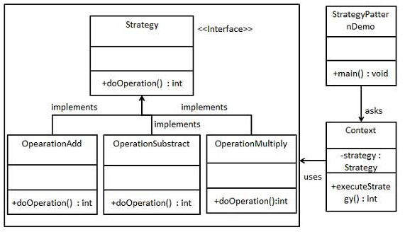

## Simple Factory Pattern
[Insight](https://www.cnblogs.com/onepiece-andy/p/python-strategy.html)  
[code](https://github.com/wan-h/BrainpowerCode/blob/master/DesignPatterns/StrategyPattern.py)

---
### Overview  
* 意图  
定义一系列的算法,把它们一个个封装起来, 并且使它们可相互替换。

* 主要解决  
在有多种算法相似的情况下，使用 if...else 所带来的复杂和难以维护。

* 何时使用  
一个系统有许多许多类，而区分它们的只是他们直接的行为。

* 如何解决  
将这些算法封装成一个一个的类，任意地替换。

* 关键代码  
实现同一个接口。

* 应用实例  
1、诸葛亮的锦囊妙计，每一个锦囊就是一个策略。   
2、旅行的出游方式，选择骑自行车、坐汽车，每一种旅行方式都是一个策略。   
3、JAVA AWT 中的 LayoutManager。

* 优点  
1、算法可以自由切换。   
2、避免使用多重条件判断。   
3、扩展性良好。

* 缺点  
1、策略类会增多。   
2、所有策略类都需要对外暴露。

* 使用场景  
1、如果在一个系统里面有许多类，它们之间的区别仅在于它们的行为，
那么使用策略模式可以动态地让一个对象在许多行为中选择一种行为。   
2、一个系统需要动态地在几种算法中选择一种。   
3、如果一个对象有很多的行为，如果不用恰当的模式，这些行为就只好使用多重的条件选择语句来实现。

* 注意事项  
如果一个系统的策略多于四个，就需要考虑使用混合模式，解决策略类膨胀的问题。

---
### UML  

---
### Intuition  
和工厂模式的区别是，工厂模式返回的是创建的产品实例，然后使用实例的各种方法。
策略模式实例化上下文的时候将策略类传入，策略类是一个方法的多种实现，拥有相同的方法接口，
所以可以统一在上下文实例中调用。