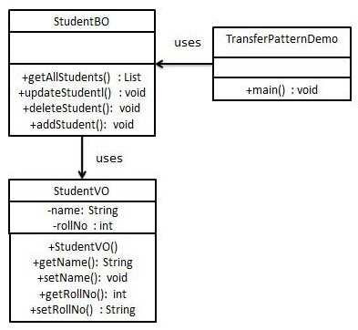

## Transfer Object Pattern
[Insight](https://www.runoob.com/design-pattern/transfer-object-pattern.html)  
[code](https://github.com/wan-h/Brainpower/blob/master/Code/CS/DesignPatterns/TransferObjectPattern.py)

---
### Overview  
传输对象模式（Transfer Object Pattern）用于从客户端向服务器一次性传递带有多个属性的数据。传输对象也被称为数值对象。
传输对象是一个具有 getter/setter 方法的简单的 POJO 类，它是可序列化的，所以它可以通过网络传输。它没有任何的行为。
服务器端的业务类通常从数据库读取数据，然后填充 POJO，并把它发送到客户端或按值传递它。对于客户端，传输对象是只读的。
客户端可以创建自己的传输对象，并把它传递给服务器，以便一次性更新数据库中的数值。以下是这种设计模式的实体。  
* 业务对象（Business Object） - 为传输对象填充数据的业务服务。  
* 传输对象（Transfer Object） - 简单的 POJO，只有设置/获取属性的方法。  
* 客户端（Client） - 客户端可以发送请求或者发送传输对象到业务对象。

---
### UML  
创建一个作为业务对象的 StudentBO 和作为传输对象的 StudentVO，它们都代表了我们的实体。
演示类在这里是作为一个客户端，将使用 StudentBO 和 Student 来演示传输对象设计模式。  
  

---
### Intuition  
可以视作数据访问对象模式的扩展应用，通讯不直接传输数据而是传输对象，通过对象可以直接进行update数据而不需要进行数据解析，
缺点是需要两端维护同样的传输对象。