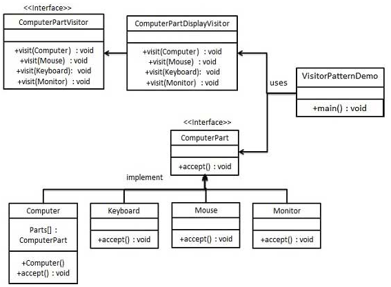

## Visitor Pattern
[Insight](https://www.runoob.com/design-pattern/visitor-pattern.html)  
[code](https://github.com/wan-h/Brainpower/blob/master/Code/CS/DesignPatterns/VisitorPattern.py)

---
### Overview  
* 意图  
主要将数据结构与数据操作分离。

* 主要解决  
稳定的数据结构和易变的操作耦合问题。

* 何时使用  
需要对一个对象结构中的对象进行很多不同的并且不相关的操作，而需要避免让这些操作"污染"这些对象的类，使用访问者模式将这些封装到类中。

* 如何解决  
在被访问的类里面加一个对外提供接待访问者的接口。

* 关键代码  
在数据基础类里面有一个方法接受访问者，将自身引用传入访问者。

* 应用实例  
您在朋友家做客，您是访问者，朋友接受您的访问，您通过朋友的描述，然后对朋友的描述做出一个判断，这就是访问者模式。

* 优点  
1、符合单一职责原则。   
2、优秀的扩展性。   
3、灵活性。

* 缺点  
1、具体元素对访问者公布细节，违反了迪米特原则。   
2、具体元素变更比较困难。   
3、违反了依赖倒置原则，依赖了具体类，没有依赖抽象。

* 使用场景  
1、对象结构中对象对应的类很少改变，但经常需要在此对象结构上定义新的操作。   
2、需要对一个对象结构中的对象进行很多不同的并且不相关的操作，而需要避免让这些操作"污染"这些对象的类，也不希望在增加新操作时修改这些类。

* 注意事项  
访问者可以对功能进行统一，可以做报表、UI、拦截器与过滤器。

---
### UML  
创建一个定义接受操作的 ComputerPart 接口。Keyboard、Mouse、Monitor 和 Computer 是实现了 ComputerPart 接口的实体类。
定义另一个接口 ComputerPartVisitor，它定义了访问者类的操作。Computer 使用实体访问者来执行相应的动作。
演示类使用 Computer、ComputerPartVisitor 类来演示访问者模式的用法。  
  

---
### Intuition  
将自身传入访问者，从而实现访问者的不同做出不同的执行。