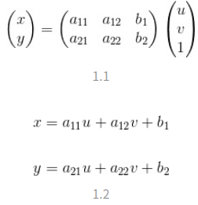

## Geometry Transform
### 仿射变换(平面变换)
[code](https://github.com/wan-h/Brainpower/blob/master/Code/Tools/Opencv/affineTransformation.py)  
实质为二维坐标变换  
  
存在6个未知数,所以需要三组映射点,三个点刚好确定一个平面(所以不能存在同一个直线上的三个点)

### 透视变换(空间变换)
[code](https://github.com/wan-h/Brainpower/blob/master/Code/Tools/Opencv/perspectiveTransformation.py)  
实质为三维坐标变换  
存在8个未知数,所以需要四组映射点,四个点就刚好确定了一个三维空间(所以不能存在同一个直线上的三个点)  
其矩阵形式为:  
  
对于每组映射点:  
  
变形为:  
  
四组映射点可以表达为一个矩阵乘法:  
  
求解矩阵m向量即可