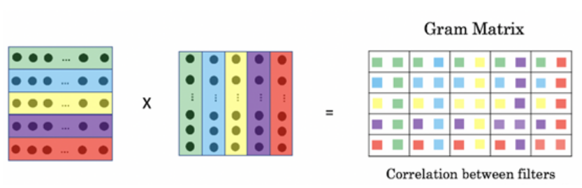

## Gram Matrix
### 定义
向量的内积就是对这两个向量对应位一一相乘之后求和的操作，内积的结果是一个标量：  
a = [a1, a2, ..., an]  
b = [b1, b2, ..., bn]  
a和b的内积为:  
a*b = a1b1 + a2b2 + ... + anbn  
内积的作用是判断向量a和向量b之间的夹角和方向关系:  
* a*b > 0: 方向基本相同，夹角在0°到90°之间  
* a*b = 0: 正交，相互垂直  
* a*b < 0: 方向基本相反，夹角在90°到180°之间  

格拉姆矩阵是两两向量的内积组成，所以Gram矩阵可以反映出该组向量中各个向量之间的某种关系。  
n维欧式空间中任意k个向量之间两两的内积所组成的矩阵，称为这k个向量的格拉姆矩阵(Gram matrix)。  
  

### 图像上的应用  
输入图像的feature map为[ch, h, w]，经过flatten（即是将h*w进行平铺成一维向量）和矩阵转置操作，
变形为[ch, h*w]和[h*w, ch]的矩阵，再对两个作内积得到Gram Matrices。  
gram矩阵是计算每个通道i的feature map与每个通道j的feature map的内积，
gram matrix的每个值可以说是代表i通道的feature map与j通道的feature map的互相关程度。  
总的来说，图像特征向量计算出来的的Gram矩阵，就可以把图像特征之间隐藏的联系提取出来，也就是各个特征之间的相关性高低，
表现出来的就是图像的风格。
* 风格迁移  
计算两个图像的特征向量的Gram矩阵，以两个图像的Gram矩阵的差异最小化为优化目标，不断调整基准图像，使风格不断接近目标风格图像。