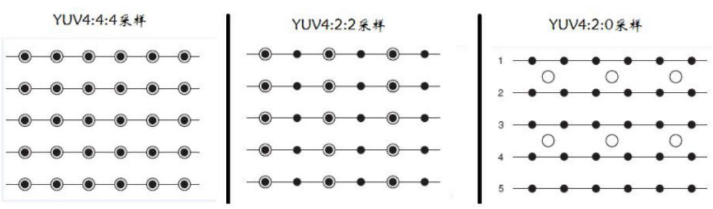
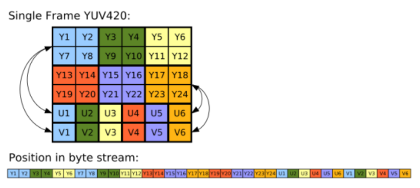
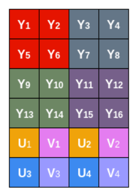
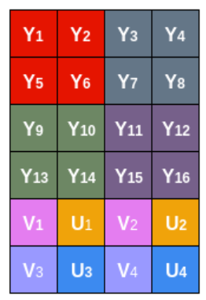
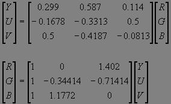

## RGB和YUV的概念  
RGB和YUV都是众多颜色空间中的一种，只是我们比较常见的是
RGB和YUV两种颜色空间  
  
---  
### RGB  
#### 概述  
RGB从颜色发光的原理来设定的，RGB分别代表红色、绿色、蓝色
三原色，其他任何颜色都可以通过三原色不同比例的叠加来形成，
我们的opencv读取图片就是用的这种格式　　
#### 存储  　　
RGB的存储方式是每个通道使用一个字节进行存储，也就是8个二进制，
范围也就是[0-255]，我们也可以叫这种格式为RGB888格式， 我们用
RGB的格式来表示图像就是一个矩阵，例如一个224宽高的图片其维度
就是[224, 224, 3]，其中最后一个维度就是三个颜色通道  
  
---  
### YUV  
#### 概述  
YUV一方面兼容了彩色电视和黑白电视，一方面从人类对亮度的敏感度
远大于红蓝出发，其中Y代表亮度信息，UV代表色彩信息，
术语YUV在计算机行业中通常用于描述使用YCbCr编码的文件格式，通常
描述中这两者可以不加区分  
#### 存储  
YUV的格式有两个大类：  
* planar
先连续存储所有像素点的Y紧接着存储所有像素点的U，随后是所有像素点的V
* packed
每个像素点的YUV连续交叉存储  
  
YUV的采样方式就有很多种了，主流的有三种：  
  
* YUV4:4:4  
每一个Y对应一组UV分量，意味着每个像素都有YUV数据，数据量和RGB是一样的
* YUV4:2:2  
水平方向相邻的两个像素共用一组UV分量，也就意味这色差信息存储减半
* YUV4:2:0  
4:2:0并不意味着只有Y，Cb而没有Cr分量，每行扫描时只有一种色度分量以2:1
的抽样率存储，这意味着相邻的四个像素共用一组UV分量  
420使用planar的常见存储方式也有几种：  
  * YU12/I420（即YUV420P）  
    
  * YV12（即YVU420P）  
  该格式与YU12基本一样，唯一的区别是先存储V分量再存储U分量  
  * NV12（即YUV420SP）  
    
  * NV21（即YVU420SP）  
    

---  
### 格式转换  
  
YUV(256 级别) 可以从8位 RGB 直接计算:  
Y = 0.299 R + 0.587 G + 0.114 B  
U = - 0.1687 R - 0.3313 G + 0.5 B + 128  
V = 0.5 R - 0.4187 G - 0.0813 B + 128  
RGB 也可以直接从YUV (256级别) 计算:  
R = Y + 1.402 (Cr-128)  
G = Y - 0.34414 (Cb-128) - 0.71414 (Cr-128)  
B = Y + 1.772 (Cb-128)  