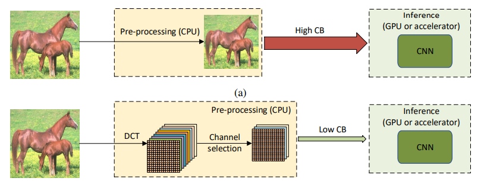
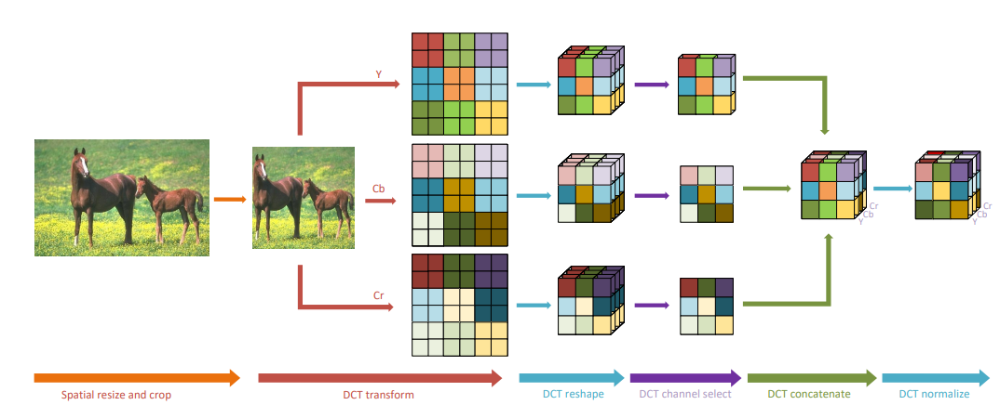
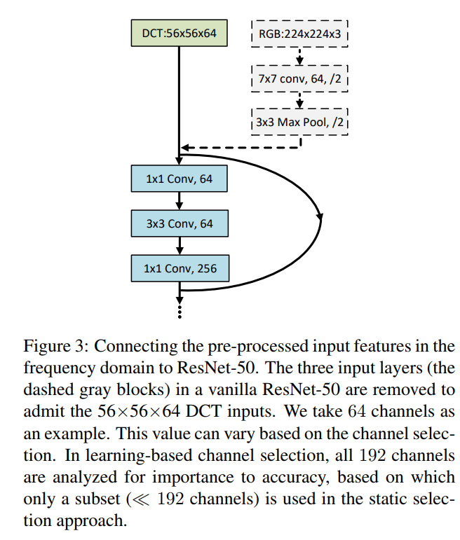
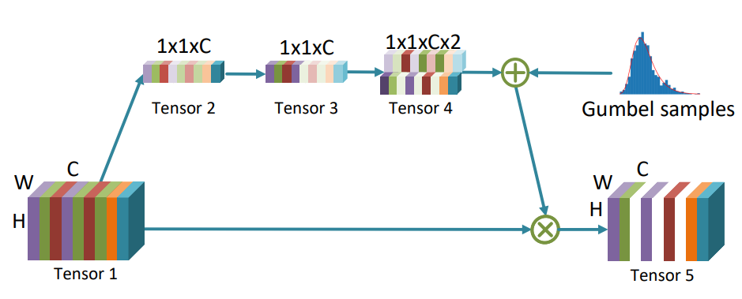

## AlexNet
[paper](https://arxiv.org/pdf/2002.12416.pdf)  
[code](https://github.com/calmevtime/DCTNet)  

---
### STRUCTURE
  

---
### Experimental Results
* ImageNet  

---
### Algorithm  
* 图像DCT处理  
  
数据处理流程:  
1.RGB图像转YCbCr  
2.将图片切成8x8的块做DCT,则可以生成W/8 x H/8个DCT块  
3.将每个块中相同位置的频率分量组成一个尺寸为W/8 x H/8 的feature map,这样会产生8x8=64个feature map  
4.对于Cb和Cr通道，也可以各自产生64个feature map,总共产生了64x3=192个feature map  
5.则DCT处理后的输出为 W/8 x H/8 x 192  
* 网络输入修改  
  
相对与原始网络,修改输入的部分即可,针对DCT处理后的192个通道可以进一步做通道的选择  
* 通道选择  
  
通道选择可以借鉴SE block的思想再192个通道中网络自学习特征通道

---
### Intuition  
通过在频域上学习,对比以往在空间域进行学习是一个新的思路,并且从实际部署的层面出发,提出了
解决输入尺寸和精度平衡上的问题,值得进一步深思和研究
