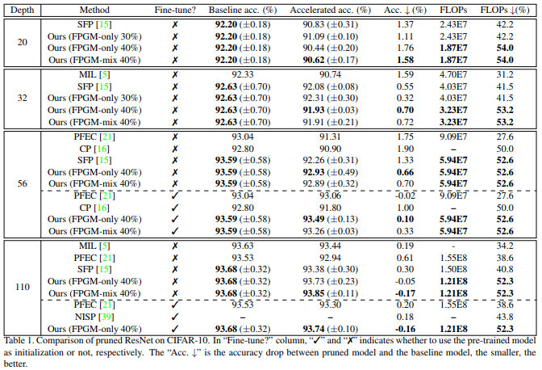
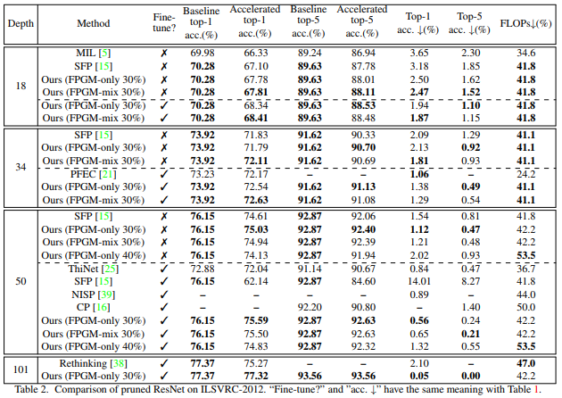
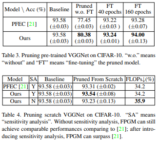
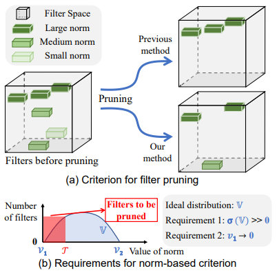
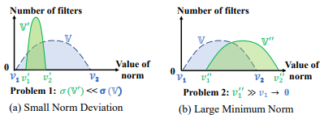

## Filter Pruning via Geometric Median for Deep Convolutional Neural Networks Acceleration
[paper](https://arxiv.org/pdf/1811.00250.pdf)  
[code](https://github.com/he-y/filter-pruning-geometric-median)  

---
### STRUCTURE
该剪枝方法可以结合到所有网络结构中，针对不同的层进行剪枝

---
### Experimental Results
* ResNet on CIFAR-10  
  
* ResNet on ILSVRC-2012  
  
* VGGNet on CIFAR-10  

---
### Algorithm  
* 对比norm-based criterion  
  
norm-based的剪枝方法剪掉norm值最小的filter，为了选择出最佳阈值，filter权重分布需要满足两个要求：  
1. norm分布足够该广（体现出大小norm filter的差异性）  
2. norm的最小值尽可能逼近于零（体现出小norm的影响小）  
然为filter实际的norm分布却往往不能满足理论需求  
  
存在分布窄，最小值远大于0的问题  
所以本论文从另一个角度出发，剪枝去掉信息表达相似度高的filter  
* GM计算方法  
通过cos或则欧式距离计算filter和其他所有filter的距离之和，值越小的表示其被其他filter表示的信息越多，
因此越应该被剪枝掉

---
### Intuition  
该滤波方法属于structed方法，会改变网路结构，选择出需要剪枝的滤波器通道后需要通过脚本去掉权重文件中对应的
权重并且重构网络后加载权重，注意通道改变后其相邻的算子通道都要改变