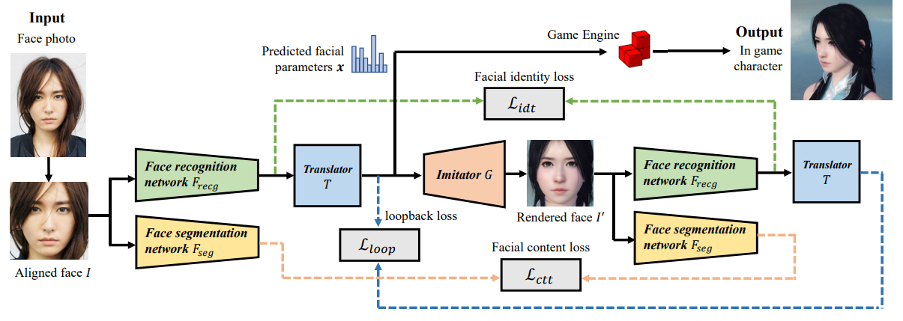

## Fast and Robust Face-to-Parameter Translation for Game Character Auto-Creation
[paper](https://arxiv.org/pdf/2008.07132v1.pdf)  
[code](https://github.com/huailiang/face-nn)  

---
### STRUCTURE

* 输入一张人脸，首先对齐矫正
* 人脸分别输入识别网络和分割网络
* 识别网络输出作为T网络输入，得到引擎参数
* G网络输入T网络的参数生成游戏人脸
* 游戏人脸也分别输入识别网络和分割网络
* 计算真实人脸和游戏人脸的识别损失
* 计算真实人脸和游戏人脸的分割损失
* 计算真实人脸和游戏人脸的参数损失
---
### Algorithm  
* Imitator  
通过Imitator找到参数和人脸生成的对应关系，这个是为了找到引擎生成数据的数学表达，
从而方便后续搭建网络来做BP。  
* Translator  
翻译器接收人脸识别模型的特征输出作为输入，输出引擎接受的参数，这是一个关键网络，
该网络学习人脸识别特征和引擎参数的对应关系，使得生成的参数尽可能的接近真实人脸。  
* Integrating facial priors  
引擎的可调整参数量是比较多的，上百个参数，直接基于这些参数训练会有不收敛的问题，很难训练，
所以采用PCA降维，论文中20个维度就有比较好的效果，所以这里的操作流程是：  
  * 利用真实人脸的有效参数数据集对所有参数进行降维，计算得到转换矩阵
  * Translator网络的输出预测的是参数空间的子空间（即降维后的空间）
  * 通过转换矩阵将T网络的输出映射回参数空间  
这样做的好处是，降低了T网络的训练复杂度，而且相当于给了一个正常人脸先验分布。
* 损失函数  
  1. Imitator的损失函数就是像素级的模型输出和引擎输出的l1损失  
  2. T网络的训练包含三个损失函数，人脸识别的相似度损失，人脸分割的相似度损失，引擎参数的相似度损失

---
### Intuition  
