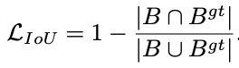
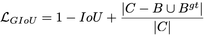
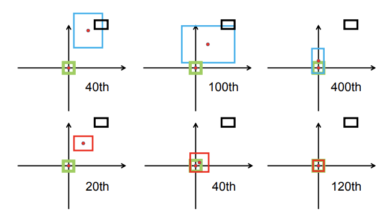
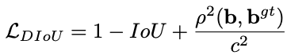
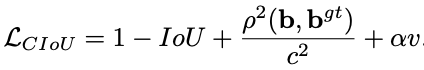
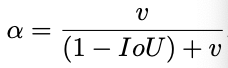
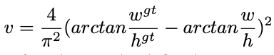

## Distance-IoU Loss
[paper](https://arxiv.org/pdf/1911.08287.pdf)  
[code](https://github.com/Zzh-tju/DIoU.)  

---
### IOU Loss  
以往的检测模型损失函数都是在预测框和真实框之间使用L1/L2分别计算中心坐标点和宽高损失函数，
实际上框的中心点和宽高不应该当作独立的变量，他们之间应该被视为目标的一个整体因素，
于是衍生出IOU Loss来替代之前的损失计算方法。  
  
预测框和真实框重合面积占比越大，损失就越小。
---  
### GIOU Loss
IOU Loss在预测框和真实框之间没有重合时，损失一直都是1，不能够提供滑动梯度，
为了解决这个问题，在IOU Loss上增加一个惩罚项。  
  
其中 C 为预测框和真实框的最小外接矩形，最小外接矩形越接近两框的相交面积，损失越小，
当两框没有重合，距离越远外接最小矩阵越大时，损失也越大。
---  
### DIOU Loss
虽然GIOU Loss解决了两框非重叠梯度消失的问题，但是经过实验发现还存在收敛慢的问题，
收敛过程中GIOU会尝试先增大预测框的大小使其能够与真实框有重叠然后才能进行IOU的收敛，如下图的第一排  
  
DIOU则通过修改惩罚项来优化收敛过程  
  
其中惩罚项分子为预测框中心和真实框中心的欧式距离，分母的c为两框最小外接矩形的对角线距离，
该惩罚项使得两框距离较远没有重合时会快速向两中心点重合进行收敛
---  
### CIOU Loss
CIOU则是对DIOU的进一步优化，在DIOU的基础上增加考虑长宽比的惩罚项  
  
其中  
  
  
该惩罚项就是加速预测框的宽高比向真实框的宽高快速收敛