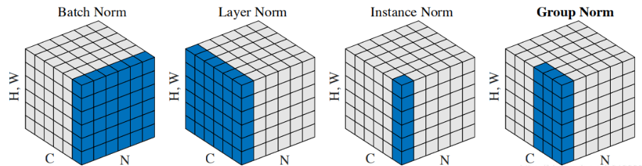

## Normalization
[Batch Normalization](https://arxiv.org/pdf/1502.03167.pdf)  
[Group Normalization](https://arxiv.org/pdf/1803.08494.pdf)  
[Instance Normalization](https://arxiv.org/pdf/1607.08022.pdf)  
[Layer Normalizaiton](https://arxiv.org/pdf/1607.06450v1.pdf)  
[Switchable Normalization](https://arxiv.org/pdf/1806.10779.pdf)  

---
### Description
  
* BN  
把每个通道的NHW单独拿出来归一化处理  
当batch size越小，BN的表现效果也越不好，因为计算过程中所得到的均值和方差不能代表全局  
* LN  
把每个CHW单独拿出来归一化处理，不受batchsize 的影响  
常用在RNN网络，但如果输入的特征区别很大，那么就不建议使用它做归一化处理  
* IN  
把每个HW单独拿出来归一化处理，不受通道和batchsize 的影响  
常用在风格化迁移，但如果特征图需要用到通道之间的相关性，那么就不建议使用它做归一化处理  
* GN  
先把通道C分成G组，然后把每个gHW单独拿出来归一化处理，最后把G组归一化之后的数据合并成CHW　　
GN介于LN和IN之间，当然可以说LN和IN就是GN的特列，比如G的大小为1或者为C  
* SN  
将BN、LN、IN结合，赋予权重，让网络自己去学习归一化层应该使用什么方法  
训练较为复杂　　
  
---
* 归一化计算方式  
  
gama和beta参数是网络需要学习的参数  
在测试阶段的均值和方差是通过训练阶段均值方差滑动平均求得的
