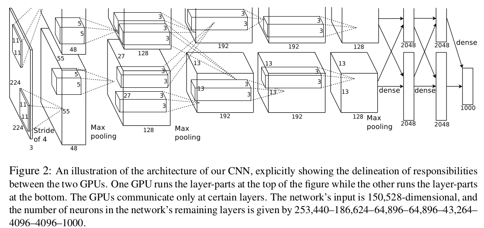
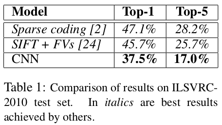
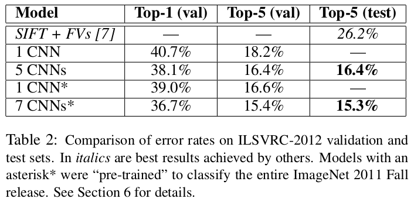
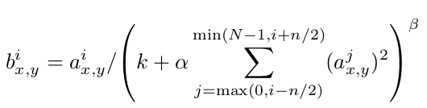

## AlexNet
[paper](http://papers.nips.cc/paper/4824-imagenet-classification-with-deep-convolutional-neural-networks.pdf)  
[code](http://code.google.com/p/cuda-convnet/)  

---
### STRUCTURE
  

---
### Experimental Results
* ILSVRC-2010 test set  
  
* ILSVRC-2012 validation and test sets  
  

---
### Algorithm  
* ReLU激活函数  
相对与tanh sigmod此类的饱和激活函数，非饱和的激活函数可以更快的收敛网络且减少了网络加深后的训练难度。  
* 多GPU训练  
由于但是硬件设备的限制，GPU限制了网络的最大尺寸，因此将网络分布到两个GPU上。
将一个层分成两部分分摊到两块GPU上，并且使GPU只在某些层上进行通信来获取另一块GPU上一层的输出
作为输入，某些层则值获取各自GPU上的上一层输出作为输入。  
两个GPU可以直接读取对方内存而不消耗主机主机内存。  
* 局部相应归一化（Local Response Normalization）  
  
表示某一点的值为其相邻通道值相互作用共同结果。受到生物学上侧抑制的启发，被激活的神经元会抑制它周围的
神经元。论文中在激活函数后使用该层，增加了模型的泛化能力。  
* Overlapping pooling  
在做池化时，使得strider小于size就会是池化区域出现重叠部分，该方案分别将top-1和top-5错误率分别降低0.4％和0.3％。  
* Dropout  
随机是一部分的神经元输出为0，从而使模型学习更加强大的泛化能力，抑制模型出现过拟合。  
再测试阶段使用所有神经元的输出并将他们的输出乘以0.5。

---
### Intuition  
训练了一个庞大的神经网络，在ImageNet LSVRC比赛中远远超过了以前最好的水平。