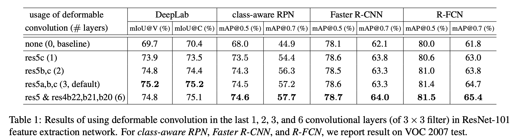
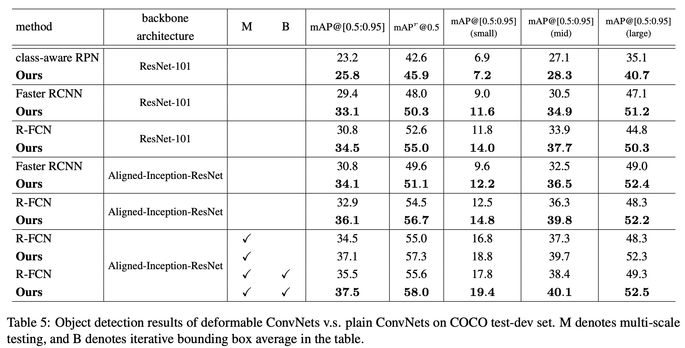
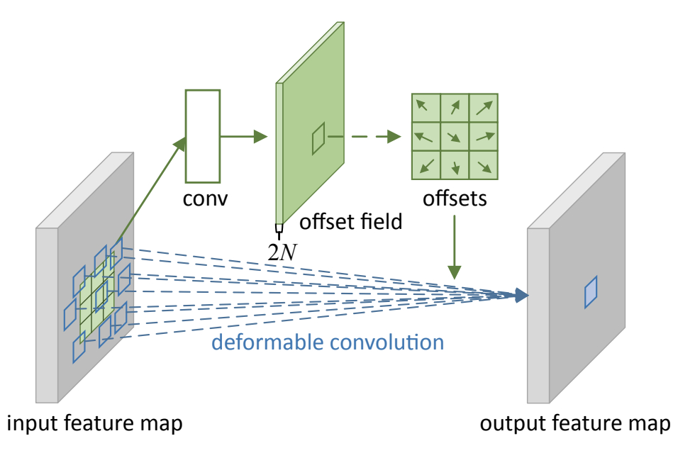
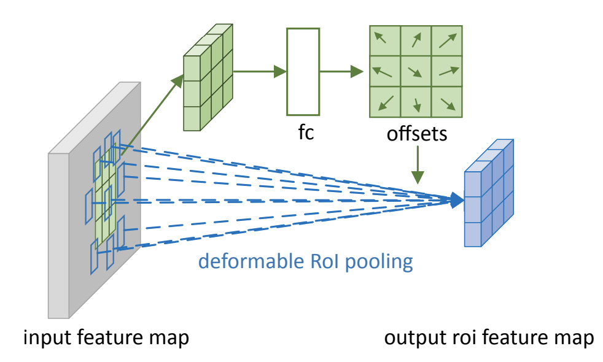

## Deformable Convolutional Networks
[paper](https://arxiv.org/pdf/1703.06211.pdf)  
[code](https://github.com/msracver/Deformable-ConvNets)  

---
### STRUCTURE
主要提出可变形卷积和可变形池化，可以扩展到其他所有的网络结构中

---
### Experimental Results
* VOC 2007 test  
  
* COCO test-dev set  
  

---
### Algorithm  
* 可变形卷积  
  
1.通过普通卷积得到和原图大小，维度为2N的偏差图，其中N表示卷积核大小个数（lg:3x3卷积核N=9）。  
2.上一步生成了特征图上每一个点对应的卷积偏移量。  
3.可变形卷积就是在普通的卷积基础上将卷积算子各点对应到相应的偏移点后再做卷积计算。（使用双线性插值求的对应点值）

* 可变形ROI池化  
  
1.得到标准池化对一个ROI每个bin的结果，上图得到3x3xchannel的特征图（整个ROI被划分为3x3个bin）。  
2.再接一个全连接层，其输出为特征图纬度的二倍，3x3x2xchannel，再还原到特征图上时就可以获得每个bin对应的偏移量。  
3.将偏移量作用到整个bin获得新的bin区域的值然后再针对每个偏移后的bin做池化获得最终的ROI池化值。

---
### Intuition  
论文主要解决在目标尺度，姿态，视点和部件变形中适应几何变化或建模几何变换的问题。
以往的神经网络学习适应物体的形变主要是通过数据增强的方式对物体进行形变处理，
还有一种就是通过手工设计的算子（SIFT等）做滑动窗口来做匹配，然后两种都依赖人为干预，
不符合神经网路端到端的设计理念，且非刚性的物体本具有形态的不确定性，
于是论文提出了可分离卷积和可分离池化两种操作来解决以上问题，
使得神经网络主动学习这种形变的关系，在各个数据上也取得了不错的提升。
