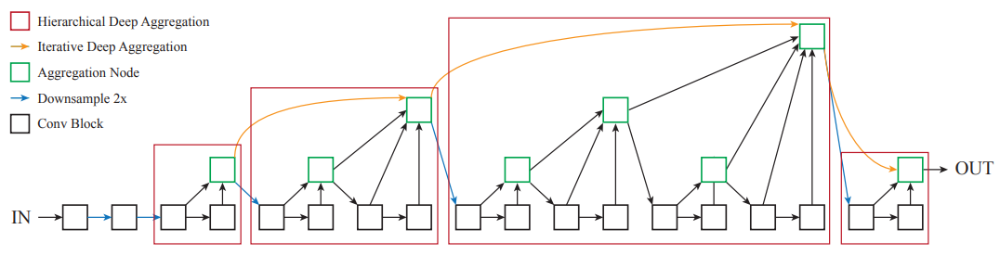
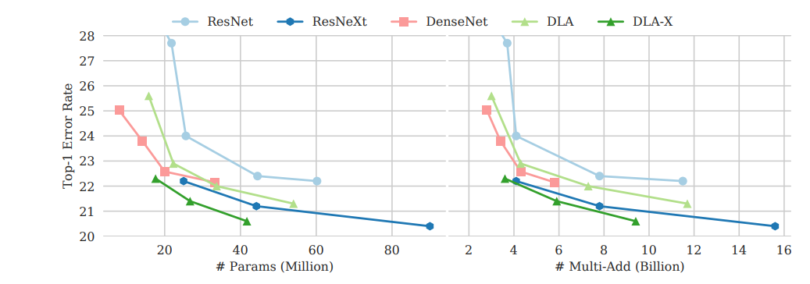
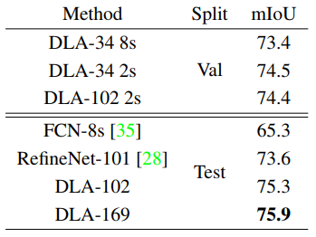
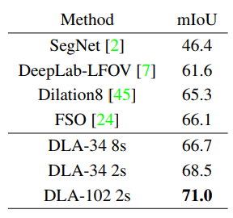
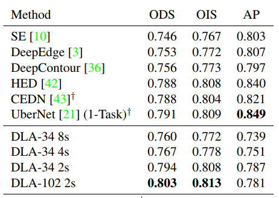
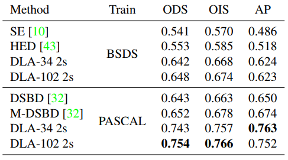
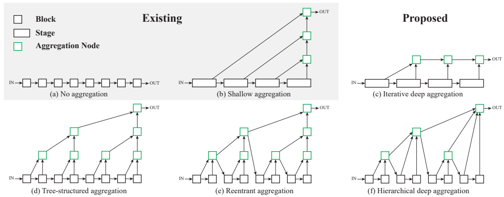

## Deep Layer Aggregation
[paper](https://arxiv.org/pdf/1707.06484v2.pdf)  
[code](https://github.com/ucbdrive/dla)  

---
### STRUCTURE

---
### Experimental Results
* ILSVRC  
  
* Cityscapes  
  
* CamVid  
  
* BSDS  
  
* PASCAL  

---
### Algorithm  
  
* Iterative Deep Aggregation  
如图c,语义融合结构，可以提高对内容的推断  
* Hierarchical Deep Aggregation  
如图f,空间融合结构，可以提高对位置的推断  
* 网络结构  
DLA的网络结构就是通过分析使用IDA，HDA的思想重构网络

---
### Intuition  
分析以往的网络结构设计，总结出设计方法从而优化网络结构