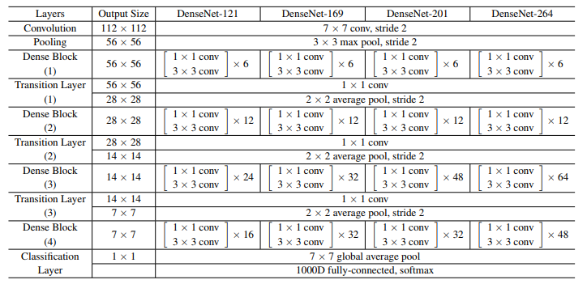
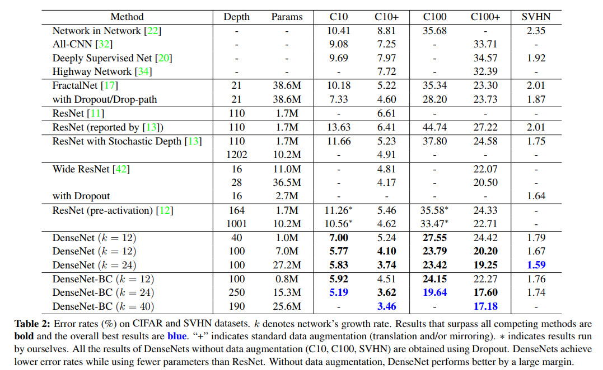
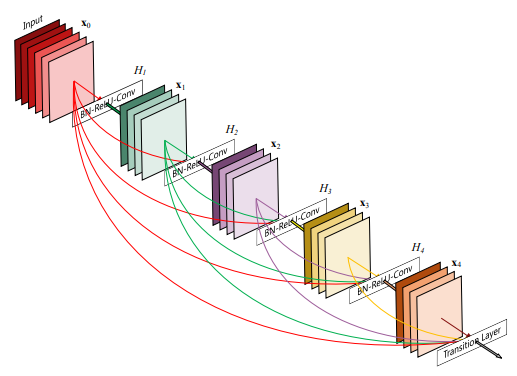
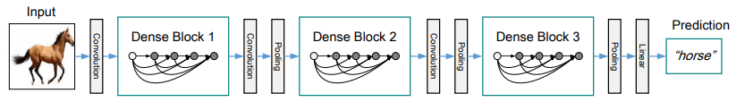

## DenseNet
[paper](https://arxiv.org/pdf/1608.06993.pdf)  
[code](https://github.com/liuzhuang13/DenseNet)  

---
### STRUCTURE 
  

---
### Experimental Results
* CIFAR and SVHN datasets  

---
### Algorithm  
* dense block  
  
区别与resnet的残差结构:  
1.前馈时将每一层都与其他的任一层进行了连接,因此网络的每一层都具有L(L+1)/2个连接  
2.不是在特征传递给某一层之前将其相加而是将其拼接(concatenate)  
模块优点:  
1.改善了网络中信息和梯度的传递,让网络更加容易训练  
2.比传统的卷积网络有更少的参数，因为它不需要再重新学习多余的特征图  
* growth rate  
dense block的每层都产生k个特征图即输出通道数为k,则第l层的特征图有k0+k(l-1),超参数k称为网络的增长速率。  
k和每个block内的层数将决定了网络的大小

* 网络结构  
  
dense block内部连接(Composite function) BN→ReLU→Conv(1×1)→BN→ReLU→Conv(3×3),其中1x1的卷积主要为了降维防止参数过多(Bottleneck结构)  
dense block间连接 BN→Conv(1×1)→Avg Pool(2×2)  

---
### Intuition  
DenseNet结构实际上与ResNet随机连接的相似,将渐层的特征传递到高层,在要达到相同精度的情况下,
DenseNet在更小的网络结构下就可以达到和ResNet相同的精度.