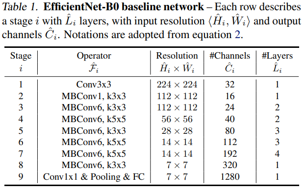
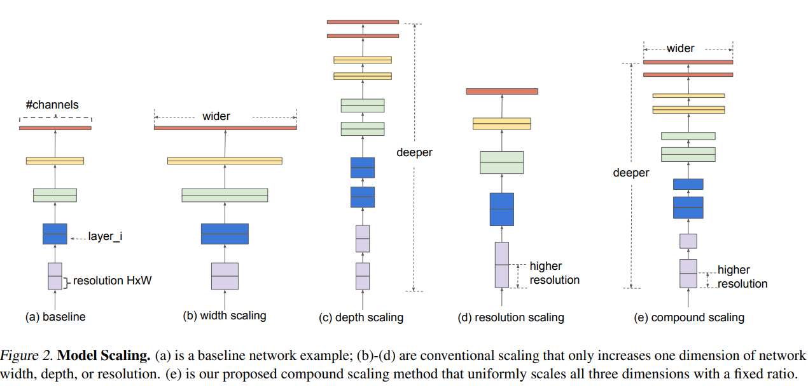
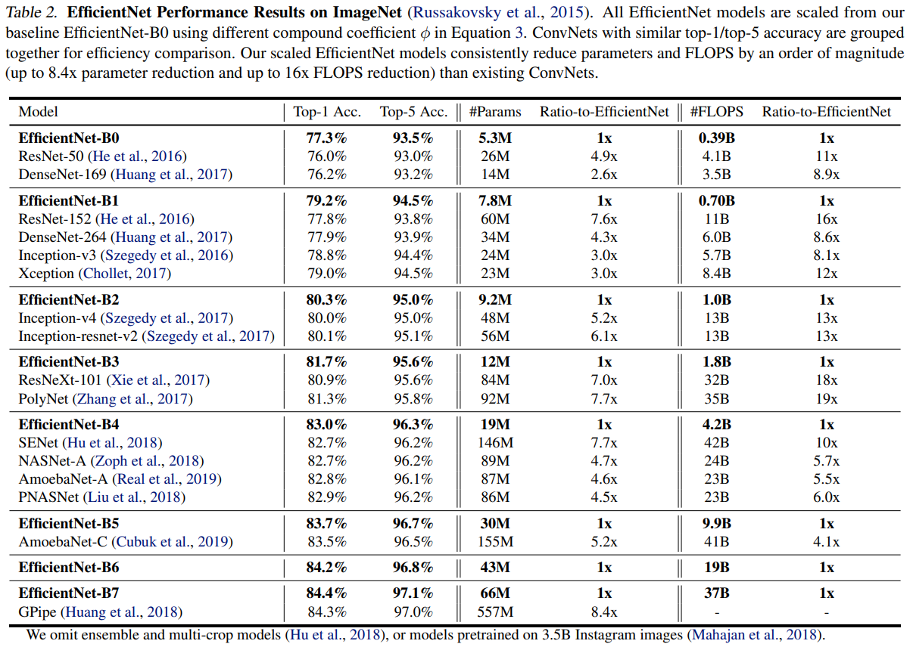
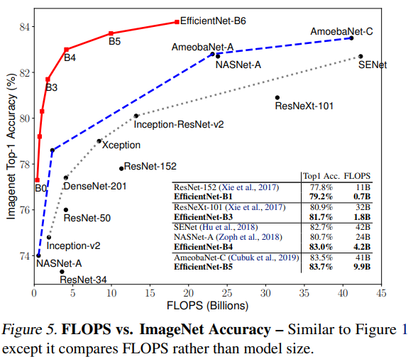
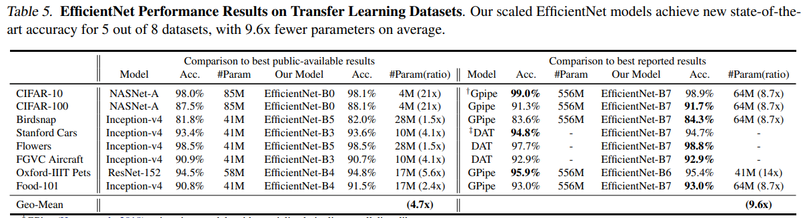

## Rethinking Model Scaling for Convolutional Neural Networks
[paper](https://arxiv.org/pdf/1905.11946.pdf)  
[code](https://github.com/tensorflow/tpu/tree/master/models/official/efficientnet)  

---
### STRUCTURE
  

---
### Experimental Results
* ImageNet  
  

* Others  

---
### Algorithm  
基于MobileNet的block，使用网络搜索探究了网络深度、宽度和输入尺寸在模型性能和效率之间的平衡。

---
### Intuition  
以往网络搜索都是针对单一变量进行搜索，本论文从影响网路的三个角度出发进搜索找到最佳网路结构。