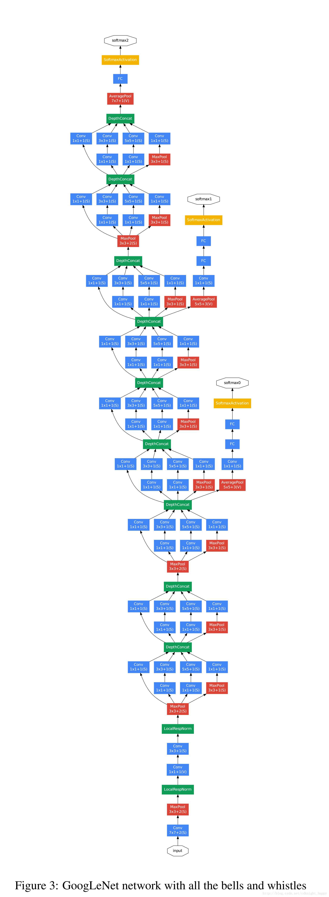
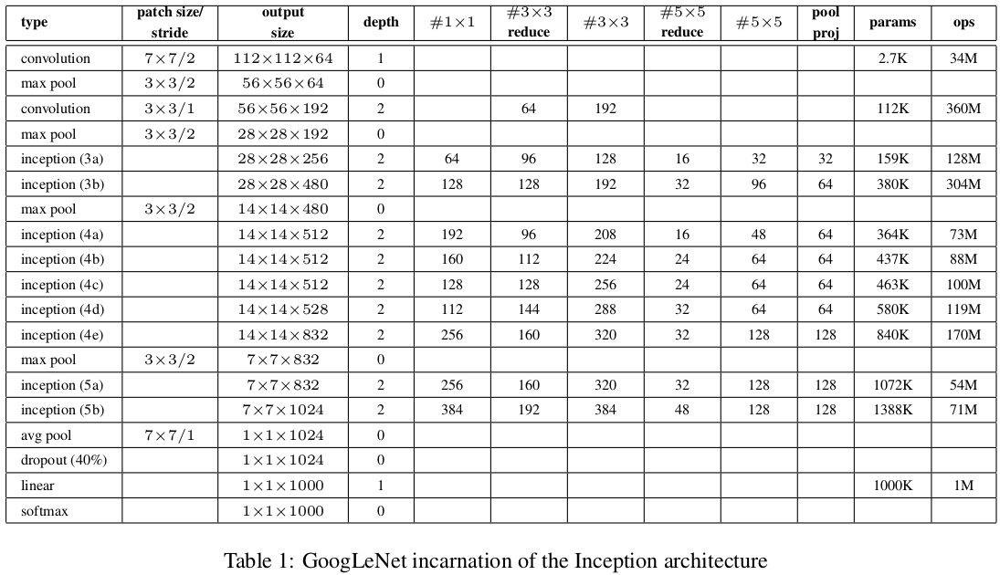
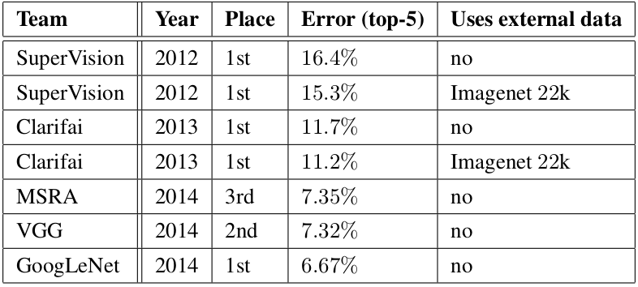
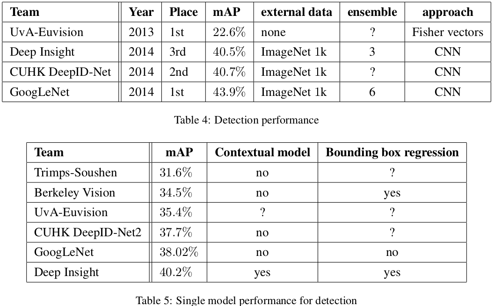
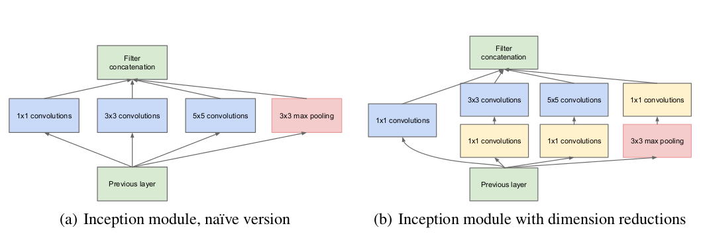

## GoogleNet
[paper](https://arxiv.org/pdf/1409.4842.pdf)  
[code](https://github.com/pytorch/vision)  

---
### STRUCTURE
  

---
### Experimental Results
* ILSVRC 2014 Classification Challenge  
  
* ILSVRC 2014 Detection Challenge  

---
### Algorithm  
* inception结构  
  
卷积的优点是利用空域的稀疏性，论文中提出的inception结构利用滤波器级的稀疏性来打破网络的对称性，从而进一步提高网络的学习水平。 
inception结构扩展了网络单元的宽度，但是导致了计算量的增大，于是设计成一种瓶颈结构，使用1x1的卷积来降低维度从而减小计算量。 
在后续的演变中这部分还存在进一步的改进。 
* 辅助损失函数  
梯度消失问题是越到浅层的梯度越来越小，辅助损失函数克服了梯度消失的问题同时提供了正则化。

---
### Intuition  
论文提出提高神经网络性能最直接的方式就是增加其深度和宽度，但是这又导致了需求更多的标注数据和更强大的运算力。
解决这两个问题一个基本的方式就是引入稀疏性并将全连接层替换为稀疏的全连接层甚至是卷积层。
论文提出了Inception结构，不仅仅增加了网络的深度，也从网络的广度着手，且通过精心的人工设计，
使得再网络深度和广度增加的情况下保证了计算量不变。  
增加宽度的设计在直觉上有一种让网络在多个卷积核上自主学习选择用哪个卷积核。
