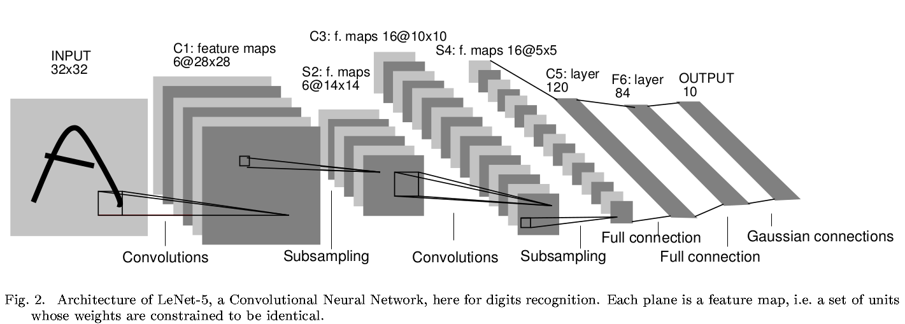
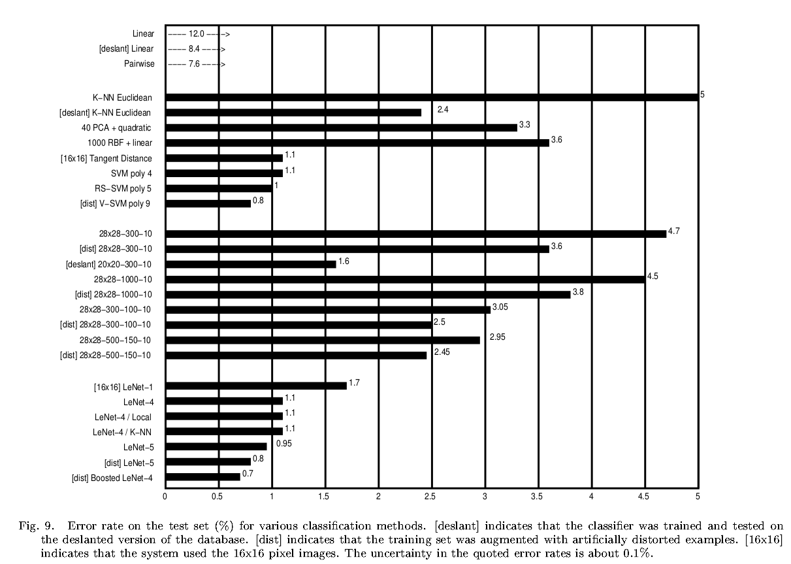

## LeNet
[paper](http://www.dengfanxin.cn/wp-content/uploads/2016/03/1998Lecun.pdf)  
[code](https://github.com/ganyc717/LeNet)  

---
### STRUCTURE
  

---
### Experimental Results
* MNIST test set  

---
### Algorithm  
* 局部感受野(local receptive fields)  
传统的神经网络是一个全连接网络，每个神经元感受整幅图片，这导致权重巨大，且不具有平移不变形和形变不变性。
全连接的神经元也忽略了图像的局部结构。论文提出局部感受野的概念，使得每个神经元只需要感受图像的局部信息。
* 权值共享(shared weights)  
通过局部感受野虽然可以降低参数量，但是要感受完一张图的多有局部信息还是需要大量的卷积核，这个参数量还是
较多，于是论文进一步提出了权值共享的概念，将局部感受野位于不同位置的神经元设置为相同的权值，
这些神经元的输出形成CNN中的一个特征图，可以通过多个卷积核来形成多个特征图来提取多个特征，这样大大降低了参数量。
* 下采样(sub-sampling)  
计算出特征图后，关注精确的特征位置反而会不利于识别，相对其他特征的大概位置才是有利的。
在特征图中降低特征位置的精度的方式是降低特征图的空间分辨率，这个可以通过下采样层达到，
下采样层通过求局部平均降低特征图的分辨率，并且降低了输出对平移和形变的敏感度。
论文通过下采样的方式使得平移和形变会更加鲁棒，实现特征不变行。

---
### Intuition  
在大数据和算力提升的促使下，LeNet的提出奠定了CNN的基础，打破了传统的图像处理方式和思维，引领了图像处理
新的发展方向，成为网络演化的基石。
