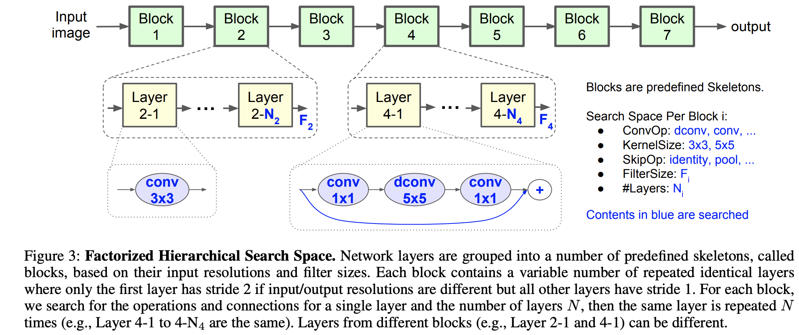

## MansNet
[paper](https://arxiv.org/pdf/1807.11626v1.pdf)  
[code](https://github.com/tensorflow/tpu/tree/master/models/official/mnasnet)  

---
### STRUCTURE
  

---
### Experimental Results
* ImageNet Classification  
  
* COCO  

---
### Algorithm  
* 网络结构搜索  
论文使用强化学习来搜索网络空间  
  
通过分解层次搜索空间来进行网络结构以及block内部结构的搜索，
将一个CNN模型分解为不同的块然后针对每个块搜索操作和块与块的连接关系，因此允许不同块有不同的层结构  

---
### Intuition  
引入强化学习来搜索最佳网路,避免具有挑战性的人工干预,是一个非常有前景的发展趋势,
但是搜索过程是需要消耗大量计算资源和时间资源的。
