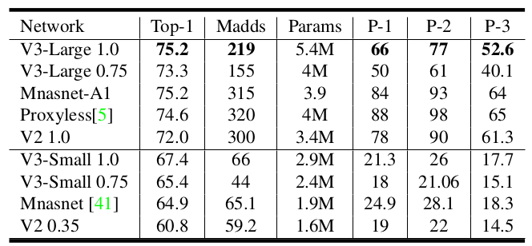

## MobileNet
### MobileNetv1
[paper](https://arxiv.org/pdf/1506.02640.pdf)  
[code](https://github.com/pytorch/vision)  

---
#### STRUCTURE
  

---
#### Experimental Results
* Classification(ImageNet)  
  
  
* Face Attributes  
  
* Face Embeddings  
  
* Object Detection(COCO)  

---
#### Algorithm
* 深度可分离据卷积（Depthwise Separable Convolution）  
  
深度可分离卷积将标准卷积分解为depthwise convolution和pointwise convolution，
depthwise convolution将单个滤波器应用到每个输入通道，所以深度卷积的数量和通道数保持一致。
pointwise convolution再通过1x1的卷积将深度卷积的输出组合起来，其通道数为特征图通道数，个数为输出通道数。  
深度可分离卷积和标准卷积计算成本比值为：  
  
一层标准的卷积结构可以通过一层深度卷积和一层逐点卷积代替：  
  
* 宽度乘数（Width Multiplier）  
宽度乘数作用于每一层的通道数上，对于给定的层和宽度乘数α，输入通道M的数量变为αM，输出通道数量N变为αN。  
可分离卷积计算成本变为：  
  
* 分辨率乘数  
分辨率乘数应用于输入图像，并且每个特征层的内部表示随后通过相同的乘法器减少。  
若设置输入分辨率乘数为ρ,可分离卷积计算成本变为：  

---
#### Intuition  
专门针对移动设备和嵌入式设备提出的网络，通过特殊的设计来构建轻量级的深度神经网络
且通过两个简单的全局超参数来折中模型的性能。

---
---
### MobileNetv2
[paper](https://arxiv.org/abs/1801.04381.pdf)  
[code](https://github.com/pytorch/vision) 

---
#### STRUCTURE

---
#### Experimental Results
* Classification(ImageNet)  
  
* Object Detection(COCO test-dev)  
  
* Semantic Segmentation(PASCAL VOC 2012 validation set)  

---
#### Algorithm  
* Linear Bottlenecks(线性瓶颈)  
V2在DW卷积之前新加了一个PW卷积。  
  
DW卷积由于本身的计算特性决定它自己没有改变通道数的能力，上一层给它多少通道，它就只能输出多少通道。
所以如果上一层给的通道数本身很少的话，DW也只能在低维空间提特征，因此会存在信息丢失。
V2为了改善这个问题，给每个DW之前都配备了一个PW，专门用来升维，经过第一个PW升维之后，DW都是在相对的更高维进行特征提取。  
V2去掉了第二个PW的激活函数，论文提出激活函数在高维空间能够有效的增加非线性，而在低维空间时则会破坏特征，
而第二个PW的主要功能就是降维，因此按照这个理论，降维之后就不再使用激活函数。  
* Inverted residuals(倒残差块)  
ResNet使用标准卷积提特征,通过先降维再升维的方式来减小参数量。
而MobileNetV2使用的是DW卷积，需要通过升维来提取高维特征，然后再降维。
这个结构个ResNet的残差块刚好相反，所以也称为倒残差。

---
#### Intuition
MobileNetV1的进一步研究，网络显著减少了计算操作和内存数量，同时保持了模型的准确性，并在
检测和分割上分别演化出了轻量级的网络SSDLite和Mobile DeepLabv3。

---
---
### MobileNetv3
[paper](https://arxiv.org/pdf/1905.02244v2.pdf)  
[code](https://github.com/SpikeKing/mobilenet_v3) 

---
#### STRUCTURE

---
#### Experimental Results
* Classification(ImageNet)  
  
* Object Detection(COCO test-dev)  
  
* Semantic Segmentation(Cityscapes val set)  
  
* Semantic Segmentation(Cityscapes test set)  

---
#### Algorithm  
* MobileNet V3 block  
  
MobileNetV3是综合了以下三种模型的思想:  
1.MobileNetV1的深度可分离卷积  
2.MobileNetV2的具有线性瓶颈的逆残差结构  
3.MnasNet的基于squeeze and excitation结构的轻量级注意力模型  
* Network Search（网络搜索）  
1.资源受限的NAS（platform-aware NAS）：计算和参数量受限的前提下搜索网络的各个模块，所以称之为模块级的搜索  
2.NetAdapt：用于对各个模块确定之后网络层的微调。  
* 改进Last Stage  
论文中提出 MobileNetV2模型中反残差结构和变量利用了1x1卷积来构建最后层，以便于拓展到高维的特征空间，
虽然对于提取丰富特征进行预测十分重要，但却引入了额外的计算开销与延时。为了在保留高维特征的前提下减小延时，
将平均池化前的层移除并用1x1卷积来计算特征图。特征生成层被移除后，先前用于瓶颈映射的层也不再需要了，
这将为减少Last Stage 10ms的开销，减小了3千万次乘加操作，提速了15%。  
 
* 提出h-swish激活函数  
论文提出swish激活函数能够有效提高网络的精度，但是计算量太大，于是提出改进版本h-swish进行激活函数的替换。  
swish激活函数:  
  
h-swish激活函数：  
  
激活函数对比：  
  
* 提出Lite R-ASPP做语义分割  

---
#### Intuition
从网路角度出发，尽可能的做到在网络设计上满足低计算消耗低延迟的要求。
利用网络搜索来做性能和模型大小之间的平衡。