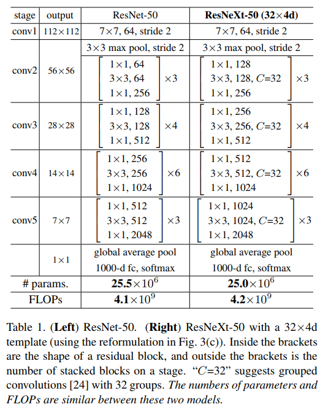
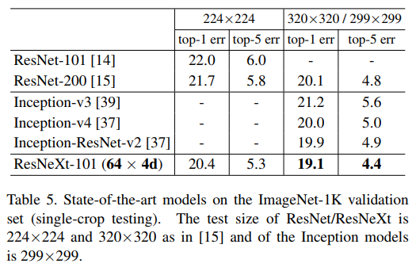
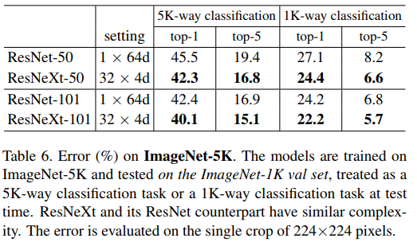
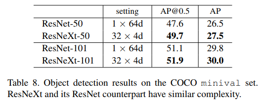
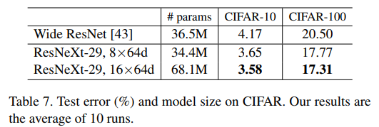
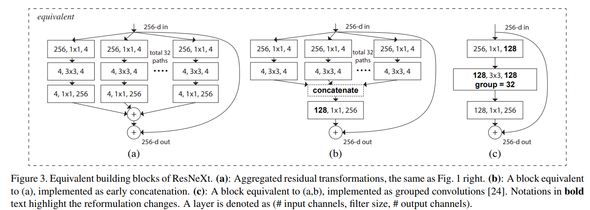

## ResNeXt
[paper](https://arxiv.org/pdf/1611.05431.pdf)  
[code](https://github.com/facebookresearch/ResNeXt)  

---
### STRUCTURE
  

---
### Experimental Results
* ImageNet-1K validation set  
  
* ImageNet-5K  
  
* COCO minival set  
  
* CIFAR  

---
### Algorithm  
* ResNeXt blocks  
  
以上三种结构为等价的ResNeXt block,其中(c)采用组卷积.  
通常使用cardinality C来表示block中多有多少个path,d表示每个path的输出通道数.  
因此ResNeXt-50(32x4d)表示每个block使用32个path,每个path的输出通道是4,即是上图中的(a).  
论文中提出cardinality的增加比增加深度或则宽度更有效.  
* 网络设计  
网络设计上受到vgg/resnet的启发,使用两个简单的规则约束来设计模块,然后做模块的堆叠:  
1.如果生成相同大小的空间映射，则块共享相同的超参数（宽度和滤波器大小）  
2.每当空间图被下采样2倍时，块的宽度乘以因子2 (确保计算复杂度)

---
### Intuition  
论文将视觉识别研究从"特征工程"过渡到"网络工程",从网络结构设计出发,总结vgg/resnet的结构策略并优化出新的网路结构.
