## ResNet
[paper](https://arxiv.org/pdf/1512.03385.pdf)  
[code](https://github.com/pytorch/vision)  

---
### STRUCTURE
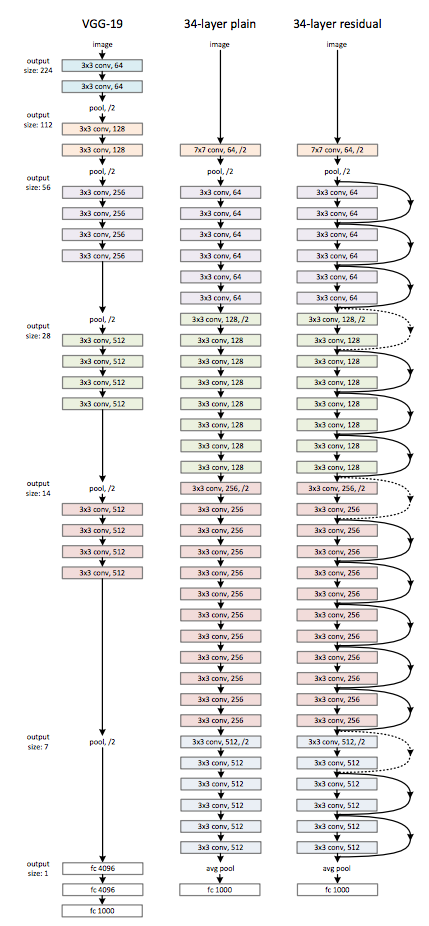  

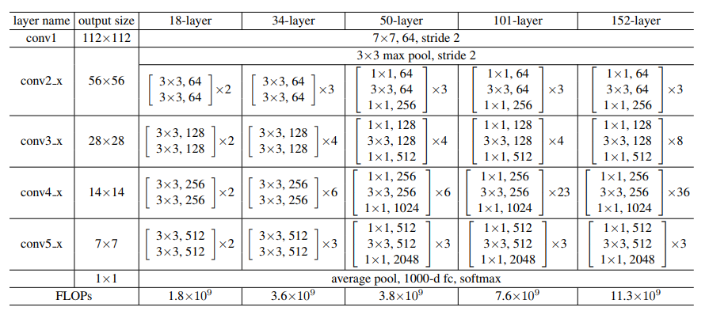

---
### Experimental Results
* ImageNet validation set  
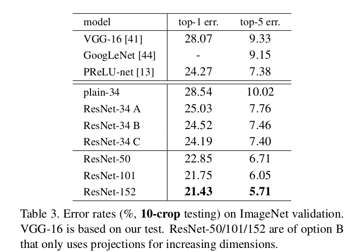  
* ImageNet test set(single-model)  
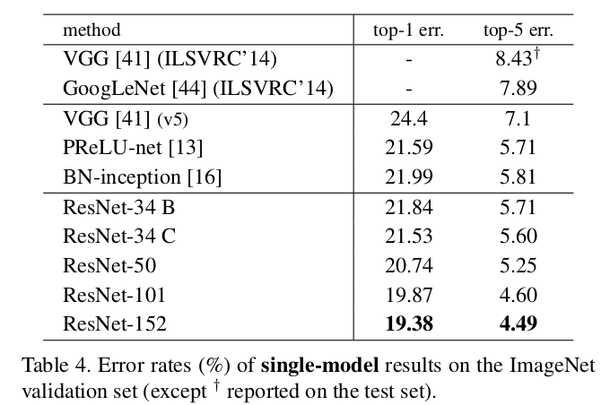  
* ImageNet test set(ensembles)  
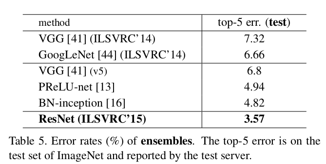  
* CIFAR-10 test set  
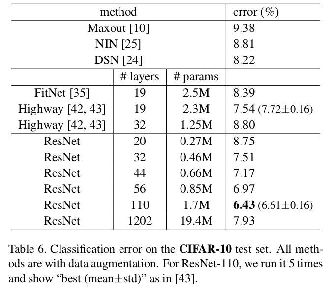  
* PASCAL VOC 2007/2012 test sets using baseline Faster R-CNN  
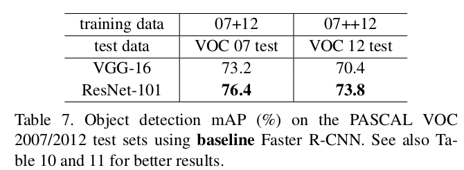  
* COCO validation set using baseline Faster R-CNN  
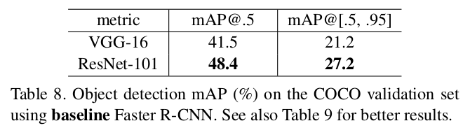

---
### Algorithm  
* 残差模块  
随着网络的加深出现了退化问题，深层网络在没有过拟合的情况下相对与浅层网络出现了更大的训练误差和测试误差。
较深的模型不应该产生比其对应的较浅模型更高的训练误差。基于此思想提出恒等映射的思想。
如果一个恒等映射是最优的，那么将残差置为零比通过一堆非线性层来拟合恒等映射更容易。  
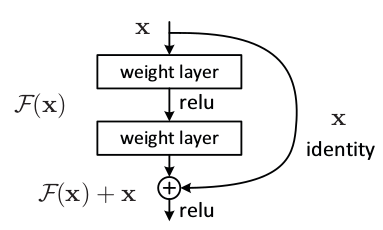  
其中F(x)就是残差项。恒等映射的快捷连接不会增加任何的参数量且不影响端到端的训练，以此可以训练更深的网络，
获得更好的模型性能。  
快捷连接F(x)和x的维度是必须相等的。若不相等则将快捷连接通过线性投影来匹配维度。  
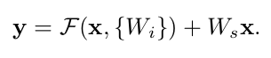  
残差函数F(x)的形式是可变的，采用了bottleneck的设计方法来进一步减少参数量。  
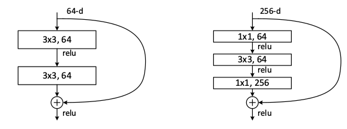  

---
### Intuition  
模型能力随着网络深度增加不断提升(学习特征随着深度来丰富)，ResNet将模型深度做到了上千层且通过残差模块
保证了模型的复杂度，为模型在深度上的探索做出了杰出的贡献。
