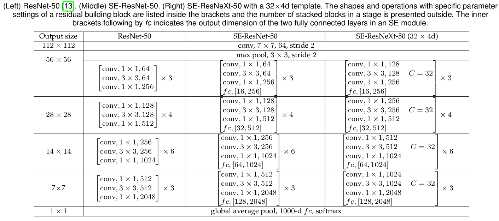
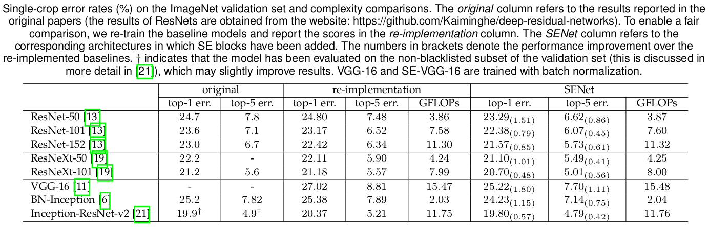
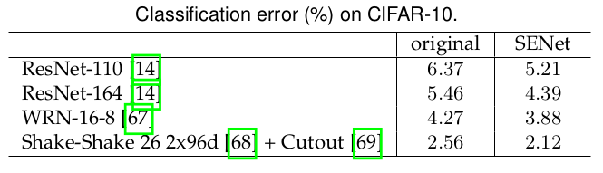
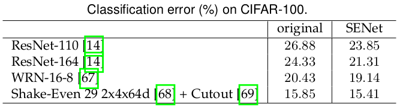
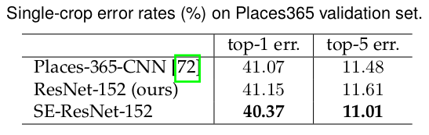
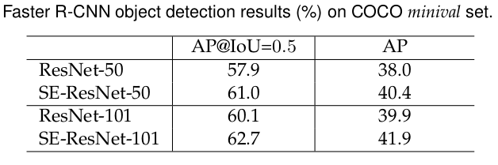
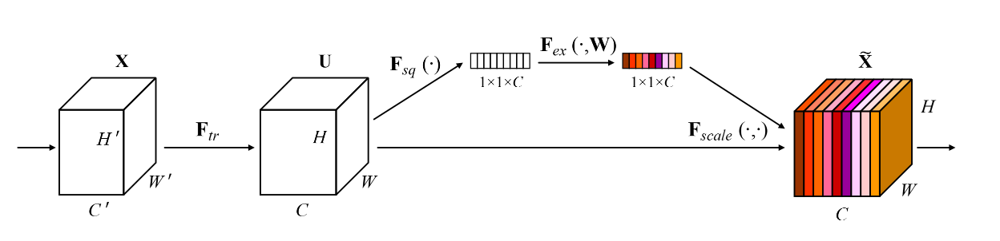
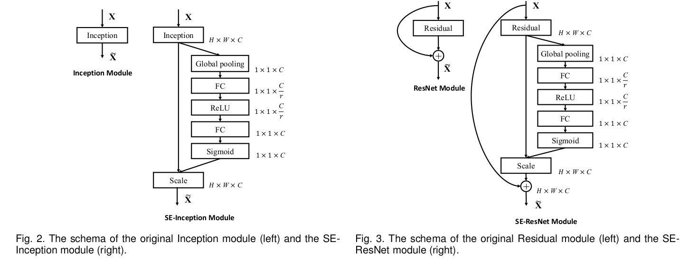
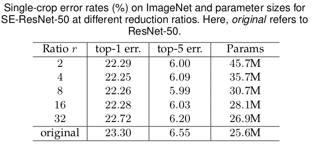

## SENet
[paper](http://arxiv.org/pdf/1709.01507v2.pdf)  
[code](https://github.com/hujie-frank/SENet.)  

---
### STRUCTURE

---
### Experimental Results  
* ImageNet 2012 dataset  
  
* CIFAR-10  
  
* CIFAR-100  

* Places365-Challenge dataset  
  
* COCO minival set  
  

---
### Algorithm  
* Squeeze-and-Excitation(SE) block  
通过显式地建模卷积特征通道之间的关系依赖性来提高网络的表达能力。
论文提出一种机制来执行特征重新校准，通过这种机制可以学习全局信息来选择性地强调信息特征并抑制不太有用的额特征。  
  
SE模块可以直接与现有的框架一起使用，SE模块的计算量是轻量级的，因此其在计算负担上只是有稍微的增加。  
  
以上SE模块中r值与精度的平衡探讨  

---
### Intuition  
SENet在神经网络中引入了attention机制，将其作用在不同的通道上，并观察到再更高层SE模块的激活性差异越大，
底层的激活性相似，说明了网络底层特征的共享，而高层特征的特异性。猜想在类别数量较多的时候通过该机制可以带来
更明显的提升效果。