## ShuffleNet
### ShuffleNetv1
[paper](https://arxiv.org/pdf/1707.01083.pdf)  
[code](https://github.com/pytorch/vision)  

---
#### STRUCTURE
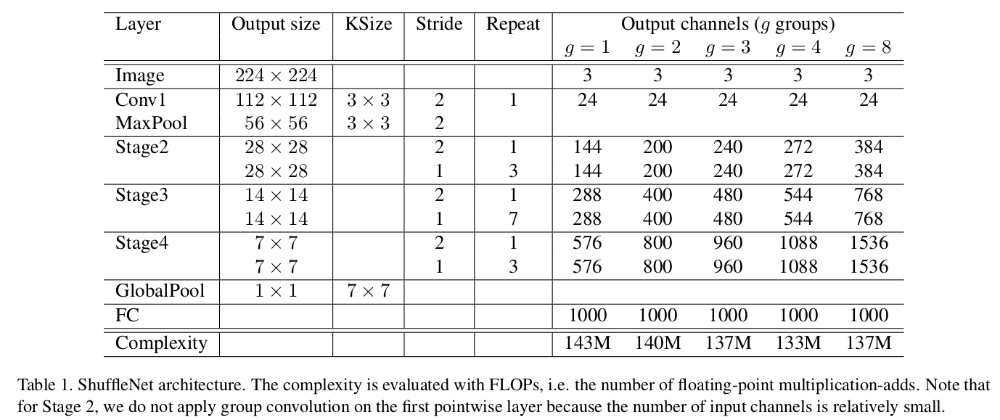  

---
#### Experimental Results
* ImageNet  
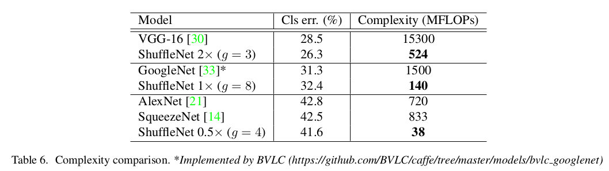  
* MS COCO  
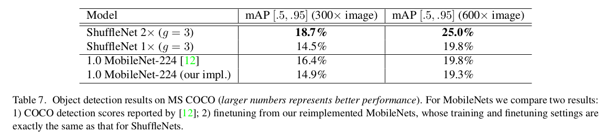  
* Actual inference time on mobile device  
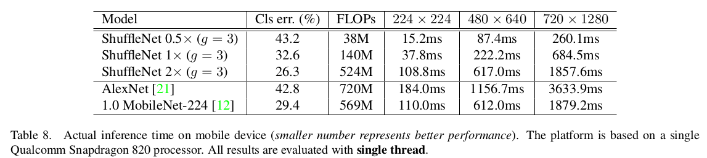

---
#### Algorithm
* Group Convolutions and Channel Shuffle(组卷积和通道混合)  
论文表述针对小型网络，Xception和ResNeXt ResNeXtResNeXt的模型效率较低，主要是因为1x1卷积消耗过多的资源，
于是论文提出了逐点组卷积来降低计算复杂度。但是组卷积又会导致各组之间的信息被封闭起来取法进行信息交流。
故再此基础上又提出了通道混洗帮组信息流通。  
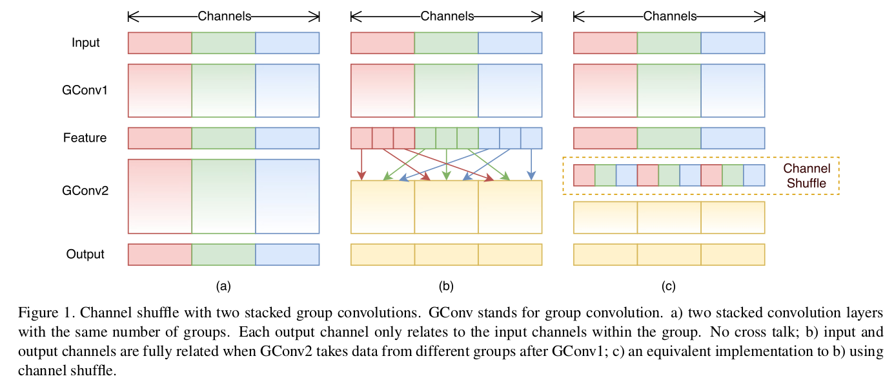  
其中组卷积实现为：  
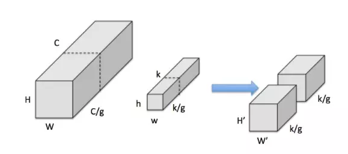  
假设输入feature map尺寸为HxWxC，同时有k个hxw的卷积核。  
组卷积将卷积分成g个独立的组，分别计算：  
1.把input feature分为g组，魅族的大小为HxWx(C/g)  
2.把kernel也分为g组，每组大小为hxwx(k/g)  
3.按顺序将input feature与kernel分别做普通卷积得到输出      
通道混洗实现为：  
  
对于一个卷积层分为g组：  
1.将输入分为gxn个输出通道  
2.reshape为(g, n)  
3.再转置为(n, g)  
4.平坦化，再分回g组作为下一层的输入
* ShuffleNet Unit  
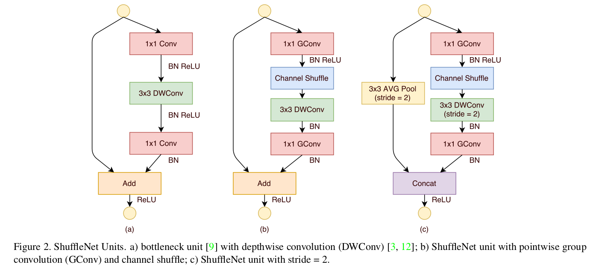  
图c为降采样的单元，在辅分支加入步长为2的3×3平均池化，原本做元素相加的操作转为了通道级联，这扩大了通道维度，增加的计算成本却很少。
给定输入大小h×w×c,通道数为c 。对于的bottleneck通道为m:

---
#### Intuition  
针对移动设备设计的网络，论文探讨在限制数十和数百MFLOPs的有限计算预算中追求最佳精度。
相比于剪枝、蒸馏等操作，ShuffleNet专注于设计更好的模型结构从而提高模型而不是加速和转换现有的模型。

---
---
### ShuffleNetv2
[paper](https://arxiv.org/abs/1807.11164.pdf)  
[code](https://github.com/pytorch/vision) 

---
#### STRUCTURE
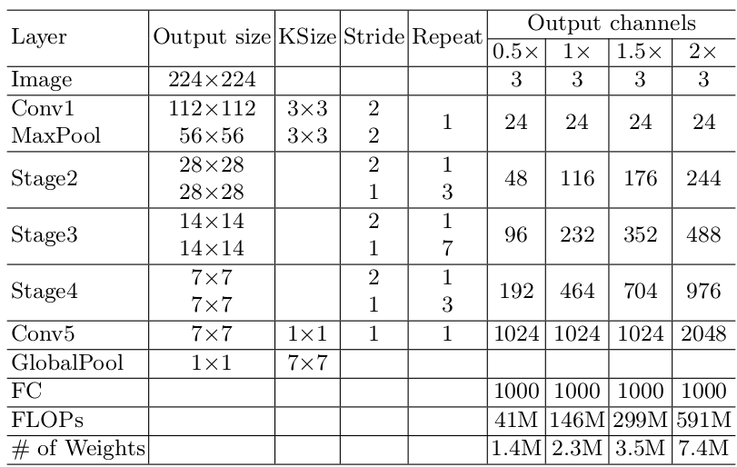

---
#### Experimental Results
* 几个大模型比较  
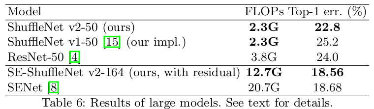  
* COCO  
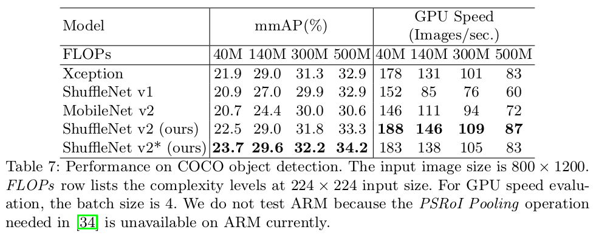  
* 多个模型综合比较  
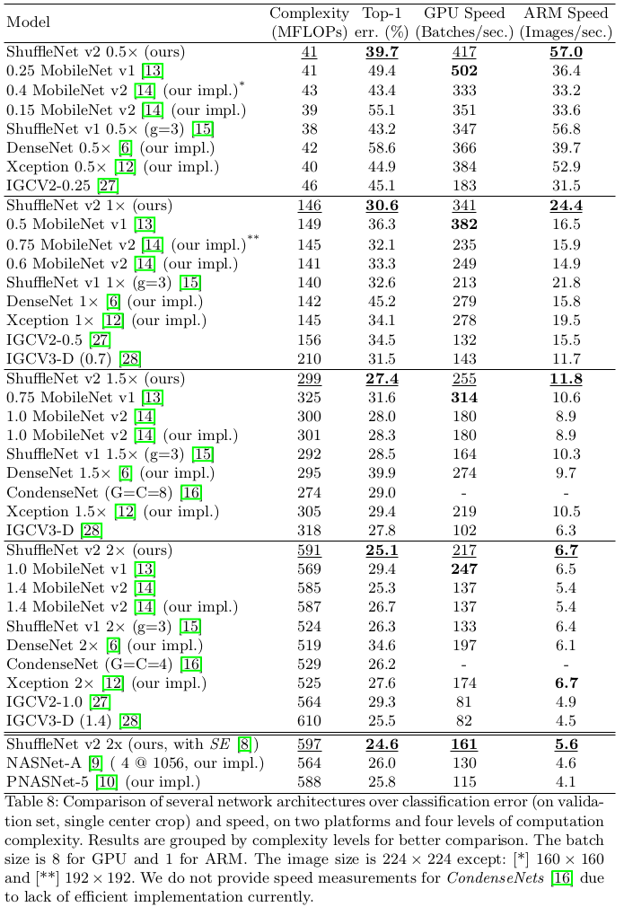

---
#### Algorithm  
* G1 提出4条关于CNN网络结构设计准则  
有相近FLOPs的网络不同的平台上的速度是不相同的，主要是因为内存访问成本（MAC）和网络的并行化程度没有考虑进去，
所以提出四条网路设计的准则进行网络优化。  
1.输入通道数与输出通道数保持相等可以最小化内存访问成本。  
1x1卷积的FLOP为B=hwc1c2  
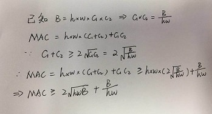  
因此当输入通道与输出通道比例为1：1时，MAC最小。  
* G2 分组卷积中使用过多的分组数会增加内存访问成本。  
1x1分组卷积的FLOP为B=hwc1c2/g  
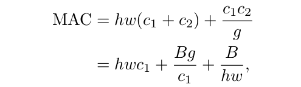  
h,w,c1,B都是固定的，随着分组数g的增加，MAC也会随之增加。  
* G3 网络结构整体的碎片化(分支和基本单元过多)会减少其可并行优化的程序  
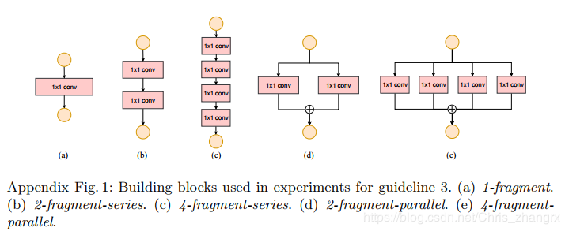  
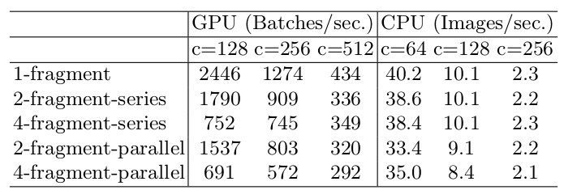
* G4 Element-wise 的操作消耗也不可忽略（包括ReLU，Tensor的相加，偏置的相加等等操作）  
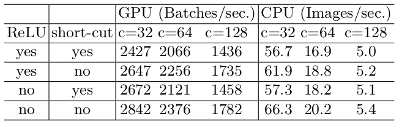  
* channel split  
通过以上四个准则对shuffleNetV1进行优化修改  
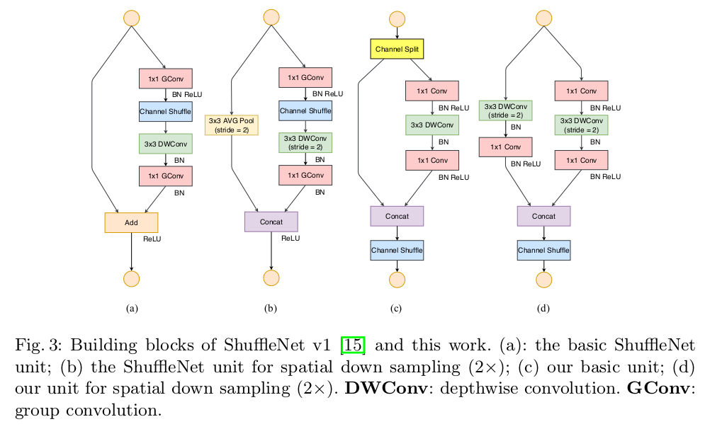  
channel split其实就是将通道数一分为2，化成两分支来代替原先的分组卷积结构（G2）  
每个分支中的卷积层都是保持输入输出通道数相同（G1）  
其中一个分支不采取任何操作减少基本单元数（G3）  
最后使用了concat代替原来的elementy-wise add，并且后面不加ReLU（G4）  
加入channle shuffle 来增加通道之间的信息交流。  

---
#### Intuition
论文提出以往的架构设计都是从网络的计算复杂度间接进行度量（FLOPS），然后直接度量（网络速度）
还取决于存储器访问成本（MAC）和平台特性等其他因素。论文通过几组实验从实际实验结果分析来重新设计网络。