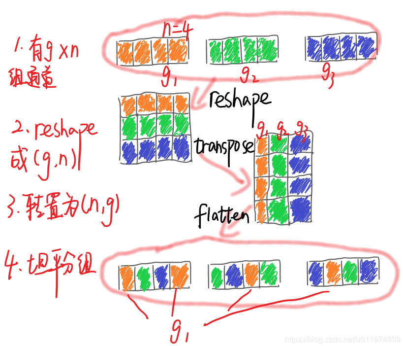

## ShuffleNet
### ShuffleNetv1
[paper](https://arxiv.org/pdf/1707.01083.pdf)  
[code](https://github.com/pytorch/vision)  

---
#### STRUCTURE
  

---
#### Experimental Results
* ImageNet  
  
* MS COCO  
  
* Actual inference time on mobile device  

---
#### Algorithm
* Group Convolutions and Channel Shuffle(组卷积和通道混合)  
论文表述针对小型网络，Xception和ResNeXt ResNeXtResNeXt的模型效率较低，主要是因为1x1卷积消耗过多的资源，
于是论文提出了逐点组卷积来降低计算复杂度。但是组卷积又会导致各组之间的信息被封闭起来取法进行信息交流。
故再此基础上又提出了通道混洗帮组信息流通。  
  
其中组卷积实现为：  
  
假设输入feature map尺寸为HxWxC，同时有k个hxw的卷积核。  
组卷积将卷积分成g个独立的组，分别计算：  
1.把input feature分为g组，魅族的大小为HxWx(C/g)  
2.把kernel也分为g组，每组大小为hxwx(k/g)  
3.按顺序将input feature与kernel分别做普通卷积得到输出      
通道混洗实现为：  
  
对于一个卷积层分为g组：  
1.将输入分为gxn个输出通道  
2.reshape为(g, n)  
3.再转置为(n, g)  
4.平坦化，再分回g组作为下一层的输入
* ShuffleNet Unit  
  
图c为降采样的单元，在辅分支加入步长为2的3×3平均池化，原本做元素相加的操作转为了通道级联，这扩大了通道维度，增加的计算成本却很少。
给定输入大小h×w×c,通道数为c 。对于的bottleneck通道为m:

---
#### Intuition  
针对移动设备设计的网络，论文探讨在限制数十和数百MFLOPs的有限计算预算中追求最佳精度。
相比于剪枝、蒸馏等操作，ShuffleNet专注于设计更好的模型结构从而提高模型而不是加速和转换现有的模型。

---
---
### ShuffleNetv2
[paper]()  
[code](https://github.com/pytorch/vision) 

---
#### STRUCTURE

---
#### Experimental Results

---
#### Algorithm  

---
#### Intuition
