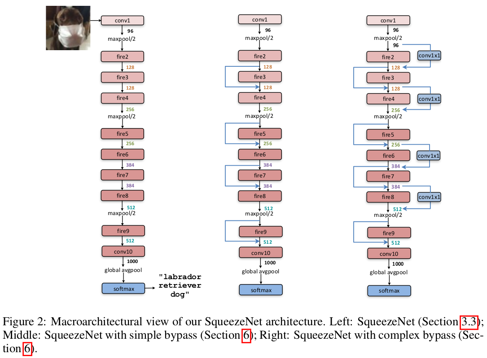
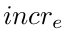

## SqueezeNet
[paper](https://arxiv.org/pdf/1602.07360.pdf)  
[code](https：//github.com/DeepScale/SqueezeNet)  

---
### STRUCTURE
  

---
### Experimental Results
* ImageNet上对比不同模型压缩方式  

---
### Algorithm  
* 提出较小网络参数量的设计策略  
1.用1x1 滤镜替换3x3 滤镜，因为1x1卷积的参数比3x3过滤器少了九倍。  
2.减少3x3卷积输入通道的数量，因为参数的总数量为：(输入通道数) * (过滤器数) * (3 * 3)。  
3.在网络中延迟下采样的时间, 以便卷积层具有较大的特征图.如果网络前半部分没有下采样则就可以获得大特征图，
大的特征图往往可以带来更高的分类精度，下采样会主要集中在网络的后半部分。  
策略1和2都是关于如何保持准确性的同时减少CNN的参数量，策略3是关于在有限的参数量预算上最大化精度。 
* Fire模块  
根据以上的设计策略设计出fire模块：  
  
为了保持1x1和3x3卷积输出具有相同的高度和宽度，对于输入到模块的3x3卷积的数据中添加用了零填充的一个像素的边界。
由于根据策略3使用的是stride为1的方式，这样1x1和3x3卷积出来的输出就是一样的维度。  
* CNN微结构设计和宏架构设计空间探索  
1.微结构设计  
定义第一个Fire模块中的expand filters的数量为：  
  
每经过freq个Fire模块后增加expand filters的数量为：  
  
所以对于第i个的Fire模块对应的expand filters数量为：  
  
由于expand layer有1x1、3x3两种卷积，所以定义expand layer的卷积数量和为：  
  
定义其中3x3卷积和数量的比值为：  
  
则3x3、1x1的卷积数量分别为：  
  
定义squeeze layer的卷积数量与expand layer卷积数量的比值为SR,则  
  
探究SR和pct3x3对模型精度的影响  

2.宏架构设计  
探究不同网络架构对精度的影响  

---
### Intuition  
论文探究了具有较少参数量的网络架构的众多优势，通过减少参数量的设计理念提出fire模块，
用fire模块搭建的网络在达到AlexNet的精度的同时将其参数量降低了50倍，而模型大小小于0.5M。