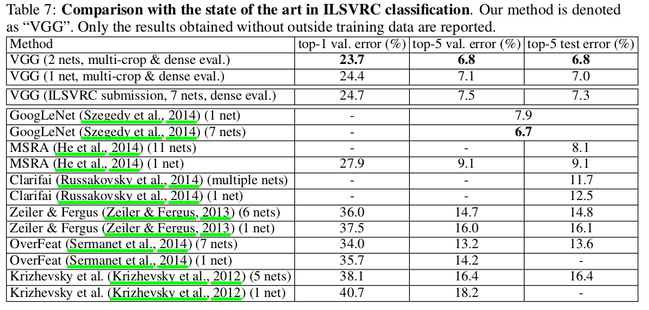

## Vgg
[paper](https://arxiv.org/pdf/1409.1556.pdf)  
[code](http://www.robots.ox.ac.uk/~vgg/research/very_deep/)  

---
### STRUCTURE
  

---
### Experimental Results
* ILSVRC classification  

---
### Algorithm  
* 用3个3x3卷积核代替7x7卷积核  
相同的感受野，但是降低的参数量以及增加两层非线性变换  
参数量计算，若输入输出都是C个通道，则参数量比值为：3(3^2xC^2)/7^2xC^2  
* 验证LRN并没有带来网络性的提升  
在AlexNet（5层）中用到的LRN在vgg十一层的结构中已经没有作用,LRN可能只对浅层网络有效果，
深层网络反而加大的内存消耗和计算量。  
* 多尺度模型  
训练阶段将图片缩放到不同的尺度进行裁剪，可以或则多尺度的图片，可以视为一种图像增强的方式。  
测试阶段将网络转化为全卷积网络，网络就对输入尺寸不敏感了，但是通过裁剪的多尺寸的图片进行评估求平均
还是会增加准确率，可以视为一种TTA的方式。

---
### Intuition  
基AlexNet后进一步去探索深度对网络的影响，证实了网络深度对网络性能的提升。在没有其他技巧的情况下，
vgg到19层后就性能就没有再提升，这可能是因为深度导致的网络退化。
