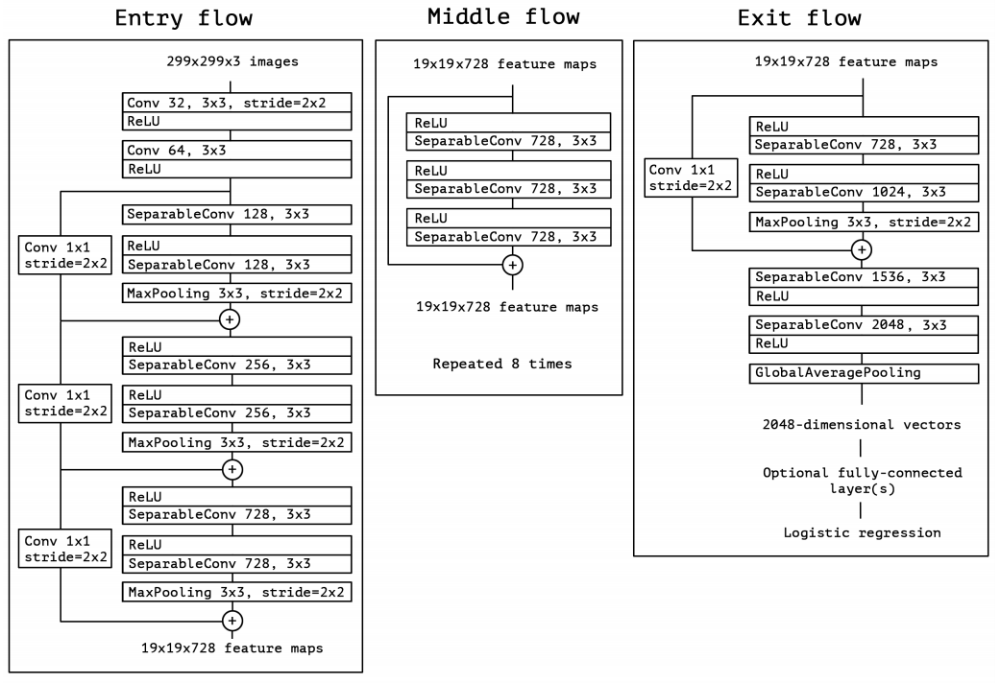
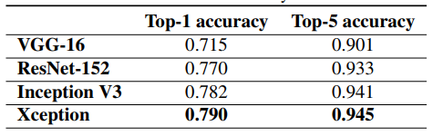
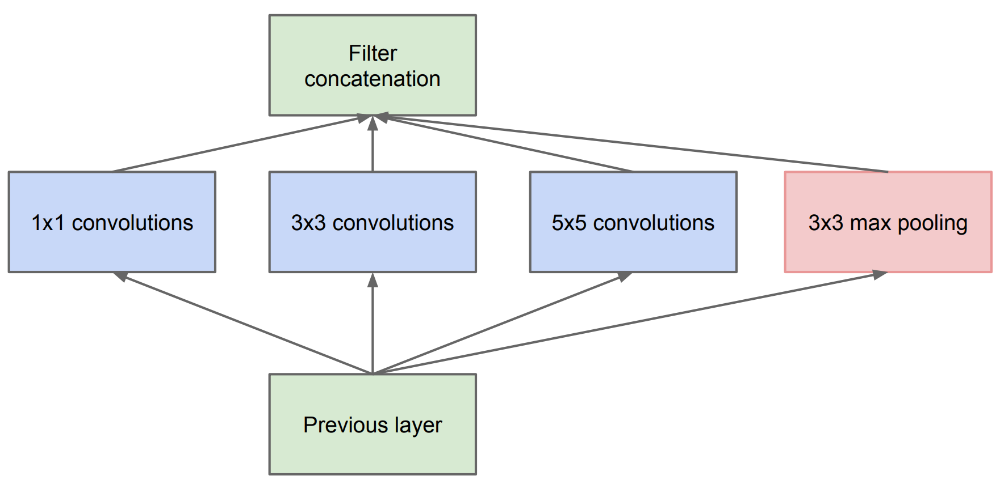
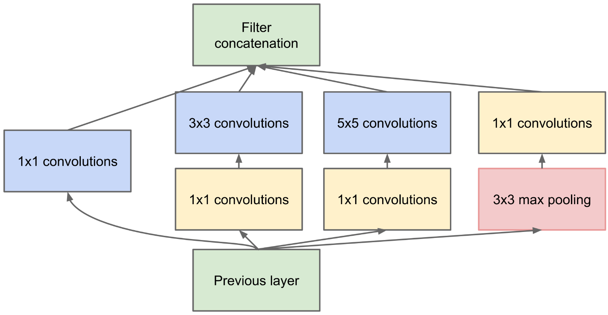
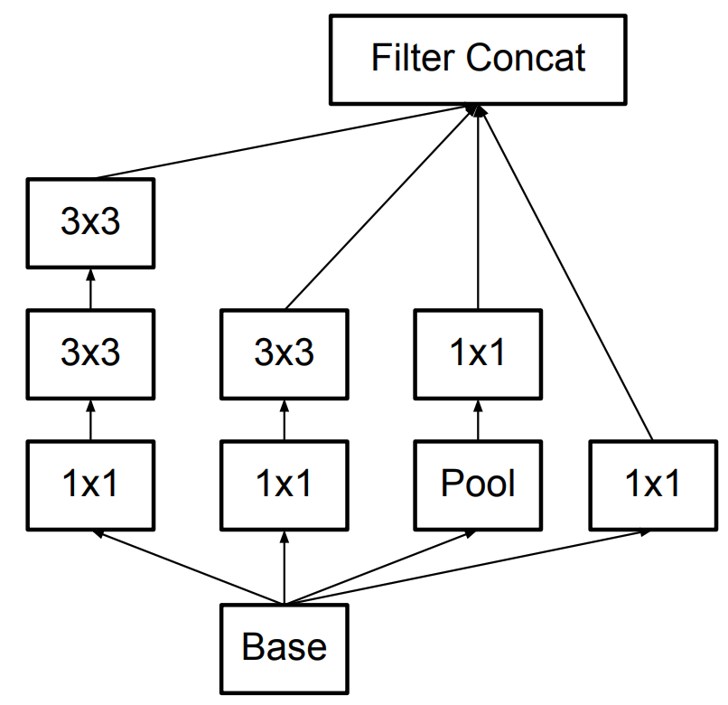
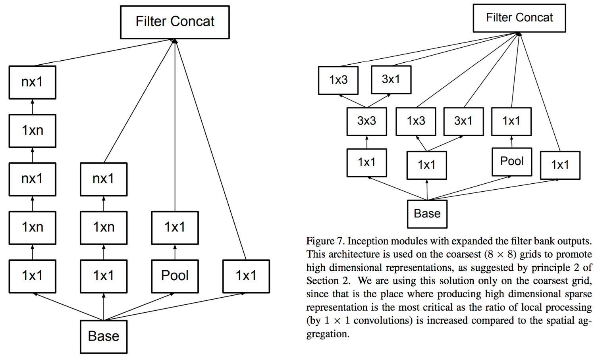
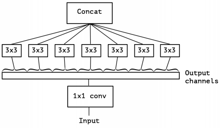

## Xception
[paper](https://arxiv.org/abs/1610.02357.pdf)  
[code](https://github.com/yanchummar/xception-keras)  

---
### STRUCTURE
  

---
### Experimental Results
* ImageNet  

---
### Algorithm  
* Inception演化  
1.InceptionV1  
  
使用1x1卷积压缩通道进一步减小计算量化  
  
2.InceptionV3  
5x5和7x7的卷积计算量还是很大,所有通过多个小卷积替换大卷积  
  
同时还演化出了其他的分解版本  
  
* 深度可分离卷积在Inception模块上的应用  
Xception是Inception的极致版本,将深度可分离卷积应用到Inception结构上进一步减少网络的计算量  
  
不同于常见的深度可分离卷积操作  
Depthwise Separable Convolution:  
1.Depthwise卷积,对输入的每个channel，分别进行3×3卷积操作,并将结果concat.  
2.Pointwise卷积,对Depthwise卷积中的concat结果,进行1×1卷积操作.  
Xception中的结构:  
1.普通1x1卷积.  
2.对1x1卷积结果的每一个channel,分别进行3x3卷积操作,并将结果concat.  
论文中阐述两种方式实际上并没有太大的差异.

---
### Intuition  
对Inception结构的机制升级版本,使用可分离卷积优化以往inception结构的网络计算量过大的问题.