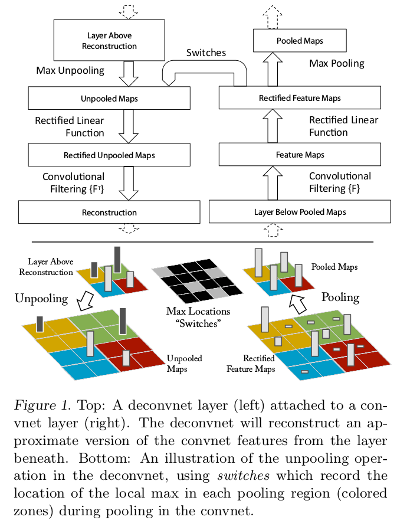
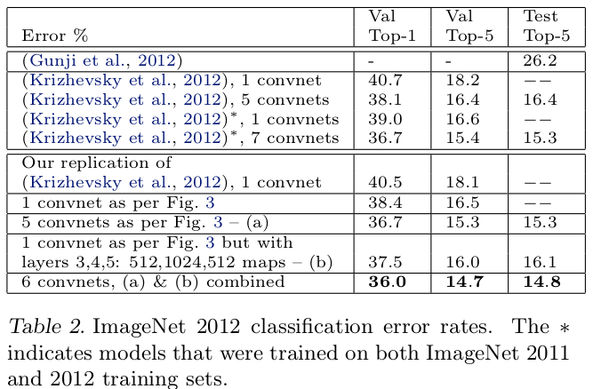
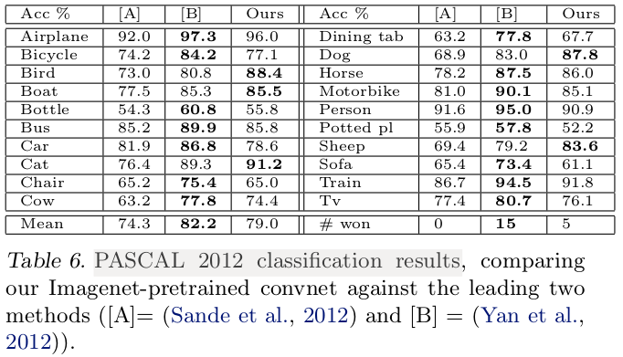

## ZFNet
[paper](https://arxiv.org/pdf/1311.2901.pdf)  
[code]()  

---
### STRUCTURE

---
### Experimental Results
* ImageNet 2012 classification error rates  

* PASCAL 2012 classification results  

---
### Algorithm  
* 输出重映射到像素空间  
反池化：池化过程不可逆，但是可以记住池化区域中最大值的位置，反池化时直接返还到相同位置，其余非最大池化位置为0。  
修正线性单元：不管是前向传播，还是后向传播，都需要特征map为正值，所以修正线性的逆变换还是其本身。  
反卷积：将卷积核转置然后与特征map卷积（卷积方式为“full”）  
* 特征可视化  
对AlexNet中的每一层做可视化后得出AlexNet的每一层的表达内容：  
第二层应对角落和其他边缘或者颜色的结合  
第三层有更加复杂的不变性，捕捉到了相似的纹理  
第四层显示了特定类间显著的差异性  
第五层显示了有显著构成变化的整个物体  
并从可视化中总结出一定的规律：  
模型的底层在少数几个epoches就能收敛聚集，然而高层在一个相当多的epoches(40-50)之后才能有所变化，
这显示了让模型完全训练到完全收敛的必要性。  
小的变化对于模型的第一层都有非常大的影响，但对于最高层的影响却几乎没有,对于图像的平移、尺度、旋转的变化来说，
网络的输出对于平移和尺度变化都是稳定的，但却不具有旋转不变性，除非目标图像是旋转对称的。  
* 基于可视化对AlexNet做模型改善  
可视化发现AlexNet第一层中有大量的高频和低频信息的混合，却几乎没有覆盖到中间的频率信息,
且第二层中由于第一层卷积用的步长为4太大了，导致了有非常多的混叠情况。
因此改变了AlexNet的第一层即将滤波器的大小11x11变成7x7，并且将步长4变成了2。
这个改进使得低层得到更多的独特的特征以及更少的无意义的特征，高层的特征更加干净，清晰，保留了更多的第一层和第二层中的信息。  
* 实验总结  
通过一个方块挡住某一区域发现如果图像中的目标被遮挡，那么被正确分类的概率会显著降低,
这表明这种可视化与激发特征图的图像结构是真正对应上的，即大概能知道位置。  
在深度模型中如何对同一类物体的不同图像进行一致性分析,低层随机遮挡情况一致性分析较差，而第7层中，一致性较好,
那是因为底层判别的是一类物体共有的部分（更注重细节），而高层判别的是类别中不同的品种这种更高维的部分了（更注重整体）。

---
### Intuition  
论文支出AlexNet虽然得到了极好的结果但是并没有科学的解释其原因，ZFNet则提出了一种神经网络可视化的方法
对网络的各层进行研究，并找到AlexNet在网络设计上的不足之处进行修改。