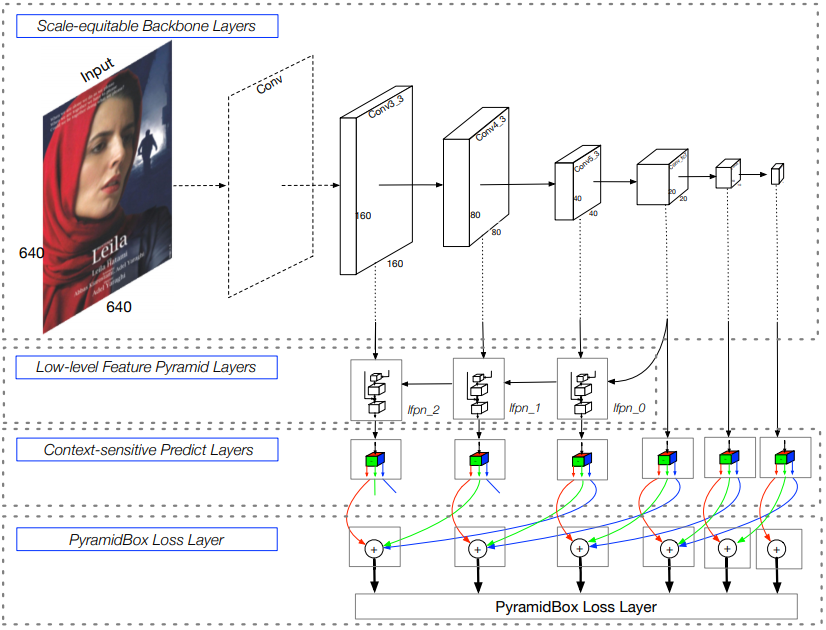
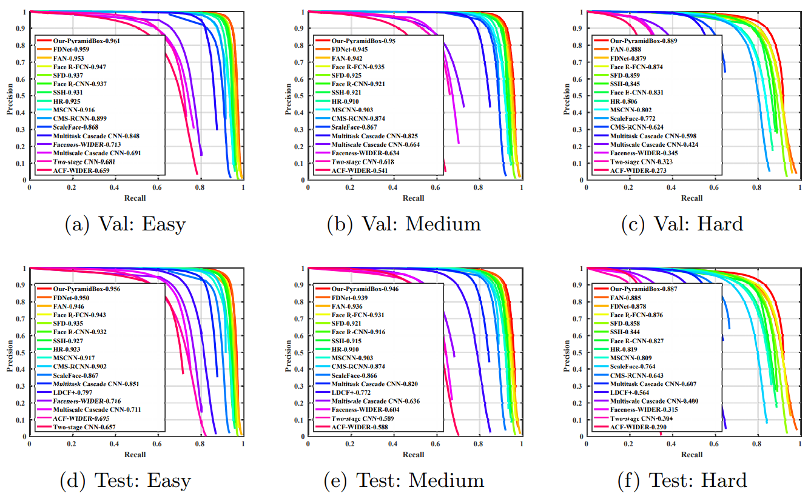
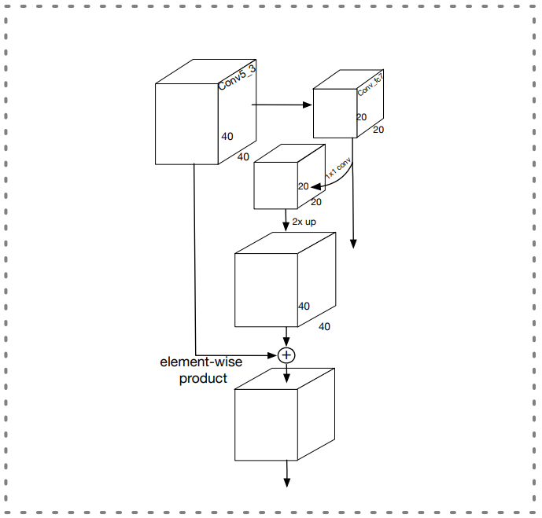
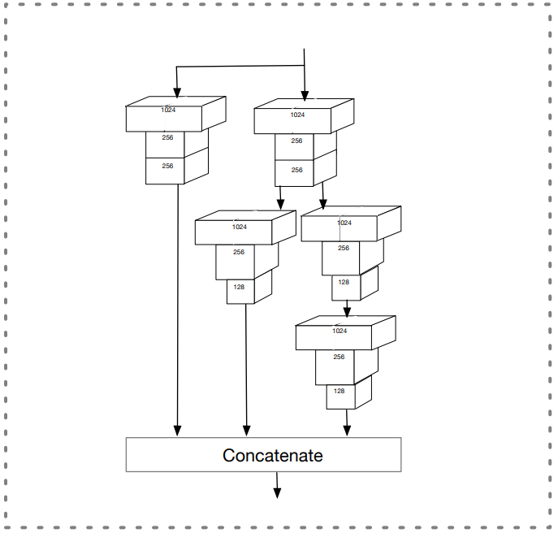
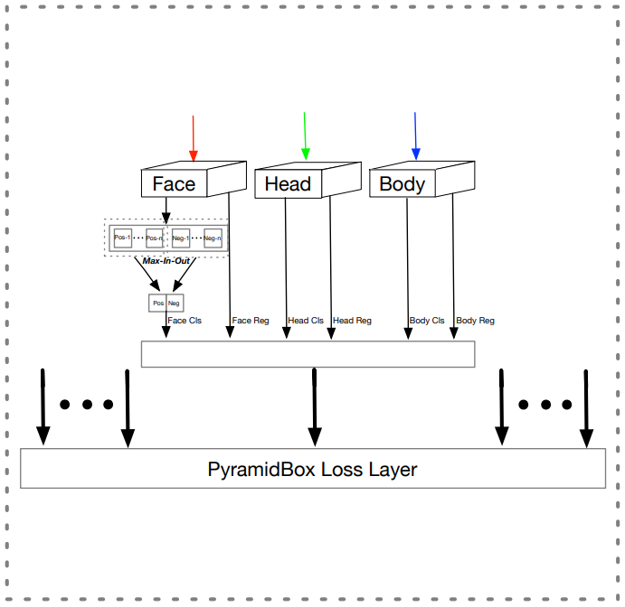

## PyramidBox
[paper](https://arxiv.org/pdf/1803.07737.pdf)  
[code](https://github.com/PaddlePaddle/models/tree/develop/fluid/face_detection.)  

---
### STRUCTURE
  

---
### Experimental Results
* WIDER FACE validation and test sets  

---
### Algorithm
* Low-level Feature Pyramid Layers  
FPN结构对结合高层语义特征和低层高分辨率特征是有意的，论文提出LFPN就是这个目的，
其网络结构类似FPN，不同的是论文指出过低的特征存在很多噪声，所以LFPN并没有从网络的
最底层就开始做特征传递，而是选择了主干网络的中间特征开始。  
其单元网络结构如下图：  
  
* Context-sensitive Predict Module (CPM)  
CPM学习了DSSD中的SSH网络结构，通过SSH网络完成不同感受野的特征融合，一定程度上将网络注意力
放大到了四周的关联信息。CPM在输出的处理上还学习了S3FD网络中的max-in-out，主要在关键检测对象
人脸上使用，在输出的四个置信度通道上取最大值，其本质就是实现了一个可以模拟任何凸函数的的激活函数，
增加了模型的学习能力，并且通过高低分辨率的采样召回率要求不同，在不同层使用的max-in-out关注对象
也不同（关注正样本还是负样本）。  
其单元网络结构如下图：  
  
* PyramidBox loss layers  
  
通过同时学习和人脸相关标签的上下信息的子任务可以促进人脸在做高级特征融合时候的注意力，有效提取
相关性特征。

---
### Intuition
论文充分吸收ssh,max-in-out论文优势，做了一个融合，并且提出了PyramidAnchors来吸收相关性
特征，这种方式可以扩展到其他具有相关性类别的学习上。