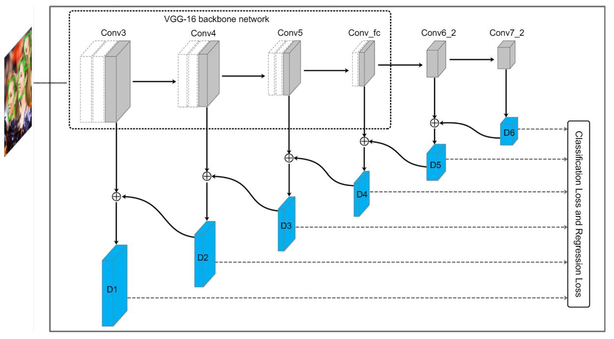
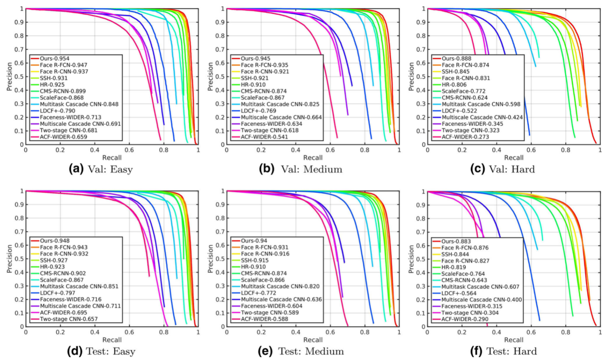
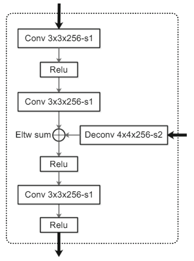
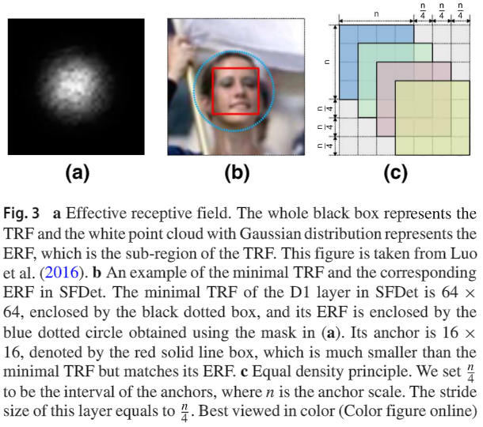
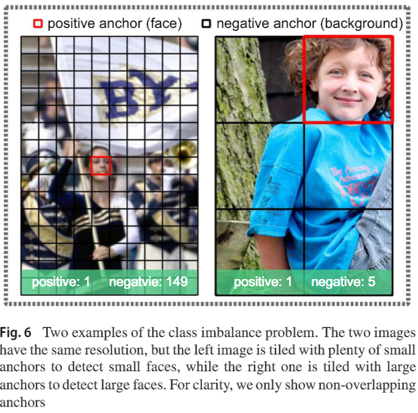
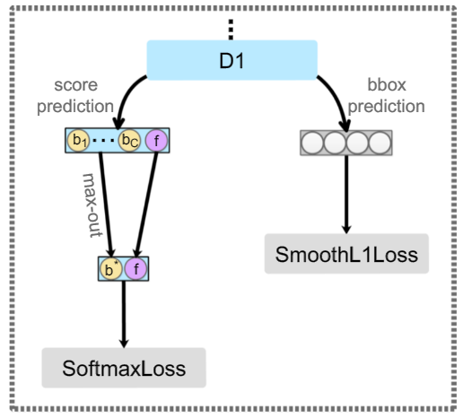
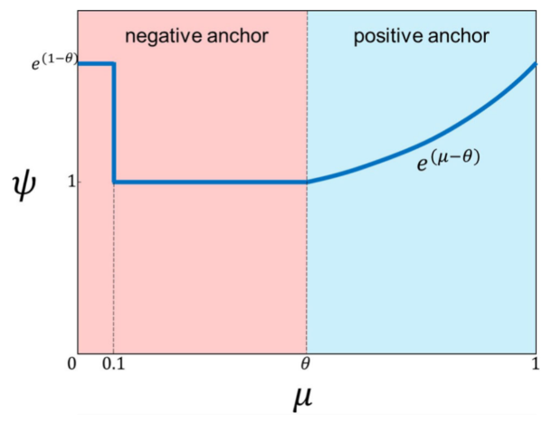

## Single-Shot Scale-Aware Network for Real-Time Face Detection
[paper](https://rdcu.be/bnCEr)  
[code]()  

---
### STRUCTURE
  

---
### Experimental Results
* WIDER FACE validation and test sets  

---
### Algorithm
* 特征融合结构  
  
类似于FPN的结构，将高级特征和低级特征进行融合，有利于在低层的人脸检测结合到
高层的上下文信息作为学习依据从而提高准确率。  
* Anchor Scales Designing  
在做anchor设计的时候，分析了理论感受野和有效感受野，并指出有效感受野通常只有实际
感受野的四分之一。  
  
所以在设置anchor stride的时候将其设置为anchor的尺寸的四分之一。  
* Max-Out Background Strategy  
  
在低级高分辨率的feature map上正负样本的比例极为不均衡，于是使用最底层feature map上使用多个
通道来表示负样本的输出并取最大值从而提高正样本推荐的召回率。  
  
* IoU-aware weights  
类似于一种难样本挖掘，给和实际框做IOU更小的负样本和IOU更大的正样本在loss中给予一个更大的权重
来进行训练。  

---
### Intuition
虽然论文是基于人脸检测的研究，但是里面很多方法在针对于检测问题中的小目标检测，背景误检问题都
值得借鉴和横向扩展。