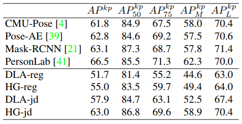
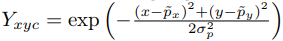

## Objects as Points
[paper](https://arxiv.org/pdf/1904.07850v2.pdf)  
[code](https://github.com/xingyizhou/CenterNet)  

---
### STRUCTURE
论文中未提供网络结构图，但是代码网络清晰  
网络head层接三个输出层：中心点热力图、宽高、中心点偏移  
  

---
### Experimental Results
* COCO test-dev  

* KITTI evaluation  

* Keypoint detection on COCO test-dev  
  

---
### Algorithm
* 生成目标热力图  
根据中心点以及网络输出大小生成目标热力图，热力图的值是通过高斯计算分布  
  
* 损失函数  
中心点热力图损失：  
  
宽高回归损失(L1 loss)：  
  
中心点偏移回归损失(L1 loss)：  
  
* nms计算  
规避了传统的nms复杂计算，直接通过max-pool获取相邻点的最大值作为中心点，但同时也带来了max-pool size的选取问题，
size的大小和目标的大小存在相关性。

---
### Intuition
在检测上从一个新的角度出发，丢弃了anchor人为经验设计的框，剔除了复杂的后处理，对并行计算和嵌入式设备移植都是福音，
是一个值得研究和发展的方向。