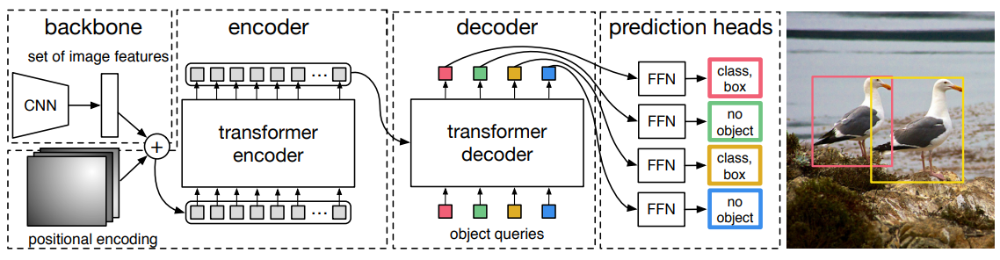
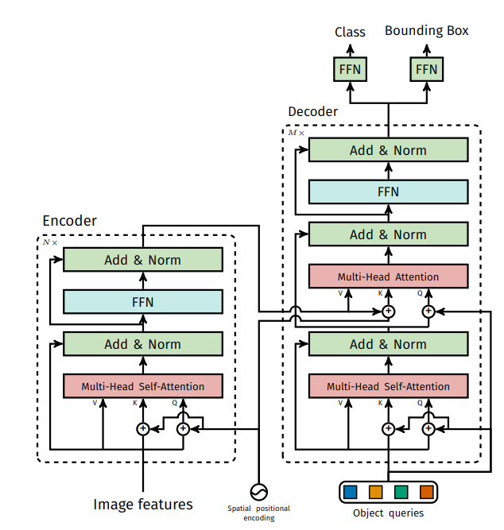
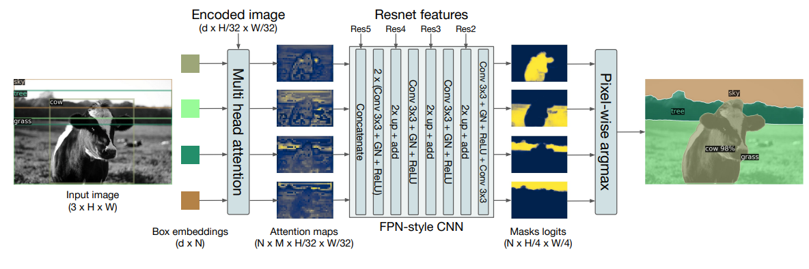
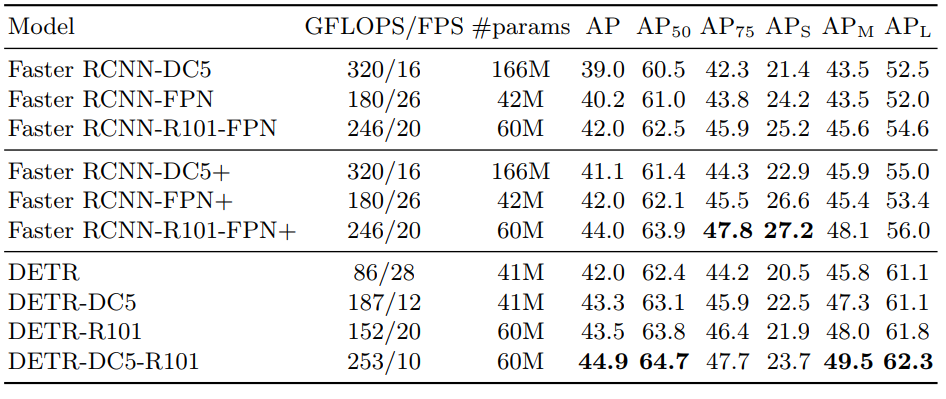
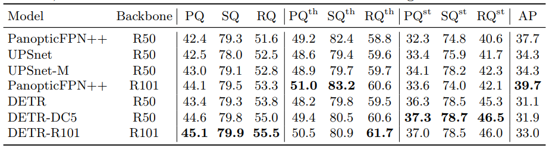

## End-to-End Object Detection with Transformers
[paper](http://arxiv.org/pdf/2005.12872v3.pdf)  
[code](https://github.com/facebookresearch/detr)  
[insight](https://www.bilibili.com/video/av838282036/)

---
### STRUCTURE
* 检测
  
  
* 分割  

---
### Experimental Results
* COCO val dataset(检测)  
  
* COCO val dataset(分割)  

---
### Algorithm
* 二分图匹配  
检测任务端到端的思想最难得就是预测和gt的映射关系怎么描述和计算loss。
本论文引入图论中的最佳匹配问题，将网络输出和gt看作是一个二分图，使用匈牙利匹配将分类，位置
最接近的点匹配到一起然后按照常见loss计算方法计算分类损失和回归损失，并对多余的非空预测做惩罚。  
* object queries  
object queries作为transformer解码器的输入，原始transformer输入是一个归并的操作，但是
这里是个随机向量（WTF?），使得transformer输出和object queries输入向量长度一致。

---
### Intuition
将NLP的网络结构应用到检测，实现了真正意义上的端到端，丢弃了以往检测任务的后处理过程，
本论文将作为新的角度研究检测任务的开篇之作。