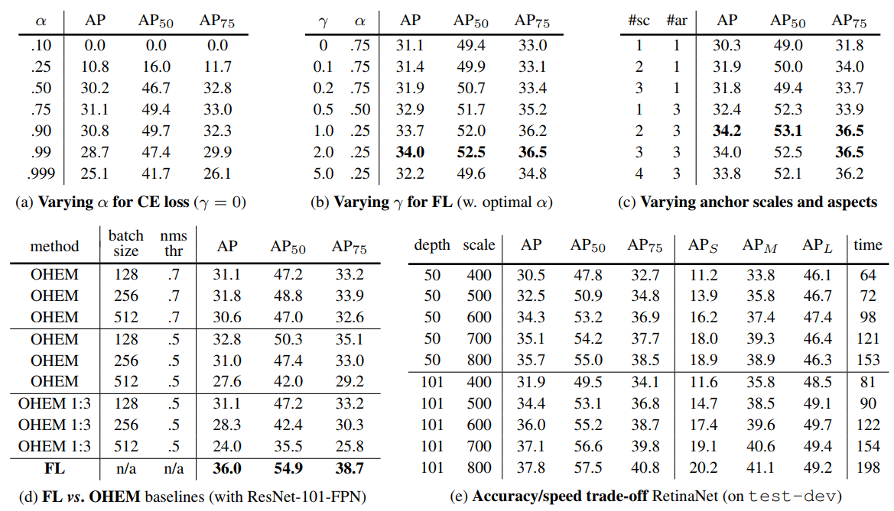

## Focal Loss for Dense Object Detection
[paper](https://arxiv.org/pdf/1708.02002.pdf)  
[code](https://github.com/facebookresearch/Detectron)  

---
### STRUCTURE
  

---
### Experimental Results
* COCO test-dev  
  
RetinaNet input 800  

* trained on trainval35k and tested on minival unless noted  
  

---
### Algorithm
* 网络结构  
其网络结构和[FPN](../../two_stage/FPN/README.md)几乎相同  
* Focal Loss  
  
与FPN的不同之处在于，使用focal loss解决类别失衡问题。图片中大部分区域都属于negative，且大多的negative
属于easy negative，所以会带来如下两个问题：  
1.negative example过多造成它的loss太大，以至于把positive的loss都淹没掉了，不利于目标的收敛。  
2.easy negative分类明确，所以其反向传播时梯度小，收敛作用很有限，网络收敛更需要的hard positive/hard negative。  
two-stage很好规避里这两个问题，RPN网路滤掉了大量的easy negative，且在后续正负样本选取时设置比例1:3来控制负样本的
数量。  
one-stage比较流行的做法是使用OHEM（Online Hard Example Mining）,通过loss排序，将大量easy negtive过滤掉，
尽量使用hard negative作为负样本。然后这个方法存在的缺陷是把所有的easy example都去除掉了，
造成easy positive example无法进一步提升训练的精度。  
于是论文提出focal loss解决这个问题：  
  
相较于直接使用交叉熵损失，focal loss给予模型更明确的类别一个较小的权重，从而将loss计算聚焦到不明确的
hard negative和hard positive，同时不会丢掉对easy positive example的训练。

---
### Intuition
网络上直接沿用了FPN网络，提出了focal loss解决检测网络数据不均衡问题，并带了较大的精度提升。