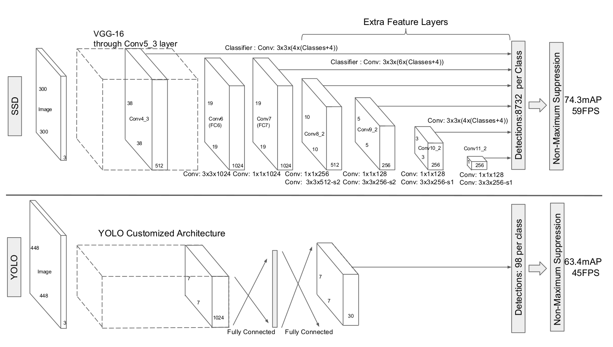
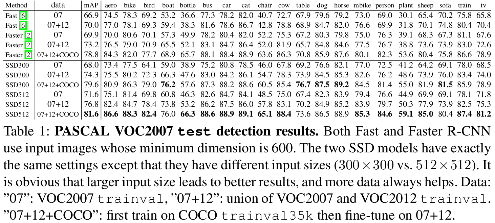
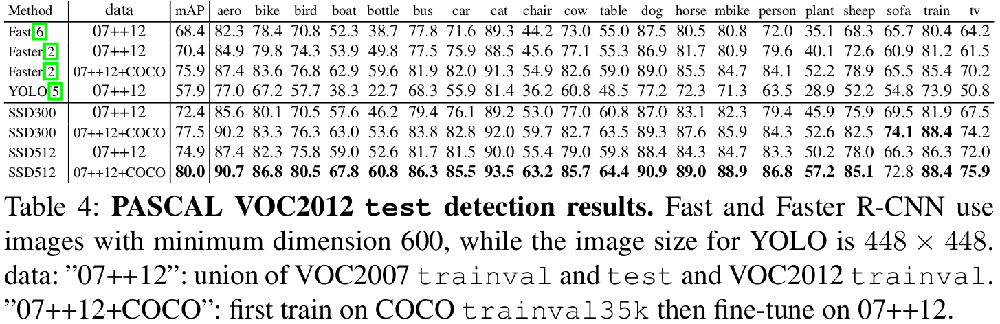
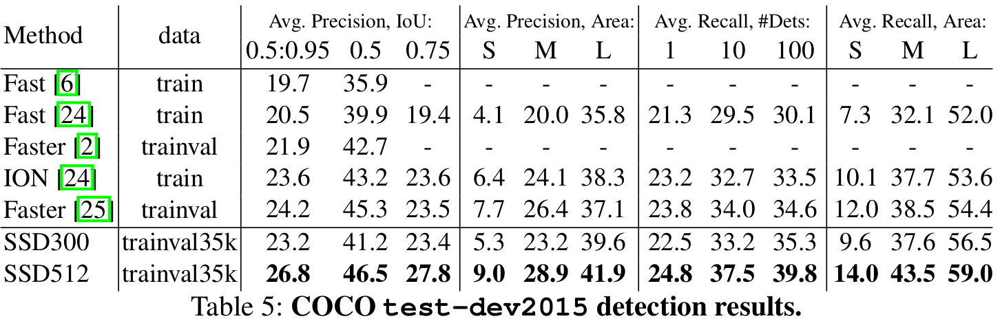
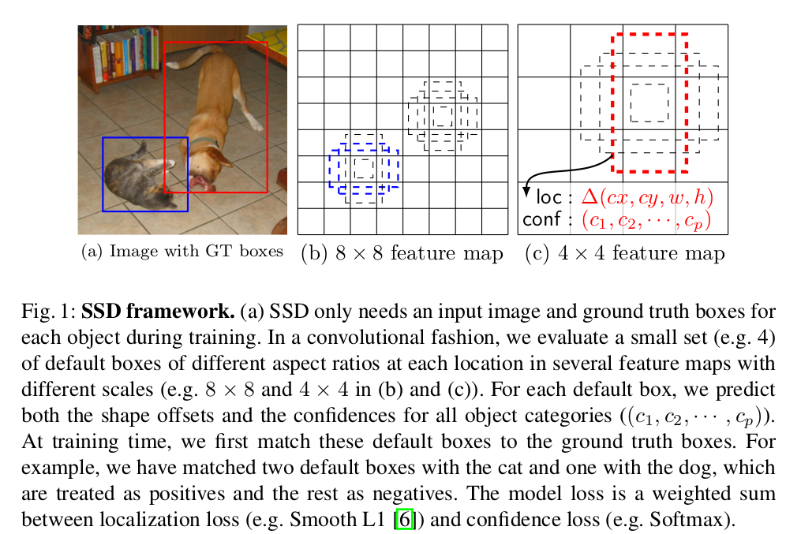
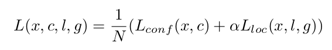
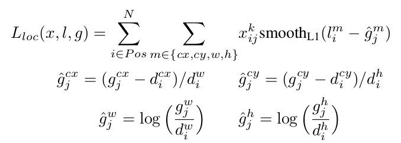
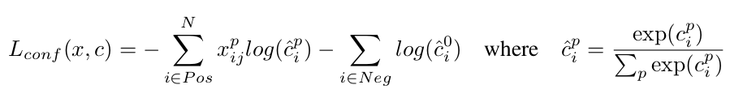

## SSD
[paper](https://arxiv.org/pdf/1611.10012.pdf)  
[code](https://github.com/weiliu89/caffe/tree/ssd)  

---
### STRUCTURE
  

---
### Experimental Results
* PASCAL VOC2007 test

* PASCAL VOC2012 test

* COCO test-dev2015
  

---
### Algorithm
* 在不同feature maps上预测提议框和gt的偏差  
  
这里的提议框通过在feature maps上滑动，且anchor的生成宽高比通常是经验的总结，
没有通过聚类获得。对于每个位置输出通道为(c+4)k，其中k为默认提议框的个数，c为类别数，4为位置xywh偏移量的编码值。
* 提议框匹配策略  
1.　对于图片中每个ground truth，找到与其IOU最大的先验框，该先验框与其匹配。
若一个提议框没有与任何gt匹配，那么该提议框就是背景，属于负样本。  
2.　对于其他与gt相交的提议框，IOU大于阈值（0.5）的也与该gt匹配。
一个gt可以匹配多个提议框，但是一个提议框只能与一个gt匹配。  
* 损失函数  
1.　总损失函数  
  
其中N为batch_ize大小，框回归和类预测通常比例是1。  
2.　框回归损失函数  
  
其中l代表预测框，g代表gt，d代表default bounding box，其余四个式子为编码过程。  
3.　类预测损失函数  
  
通过交叉熵计算损失，通常情况负样本为正样本的三倍，负样本可以通过难样本挖掘获取。
对置信度误差进行降序排序，选择误差大的那些作为负样本。  
* 不同feature maps上的提议框生成  
论文在训练部分最后一段阐述了生成提议框的规则，通过线性增长的方式为每个feature maps生成不同
尺寸的提议框，并且按照aspect ratios生成不同宽高比的提议框。

---
### Intuition
提出了一种使用单个深度神经网络检测图像中对象的方法，采用多尺寸特征层来预测不同尺寸的目标。
且通过预测与提议框的偏差来简化模型的检测问题。