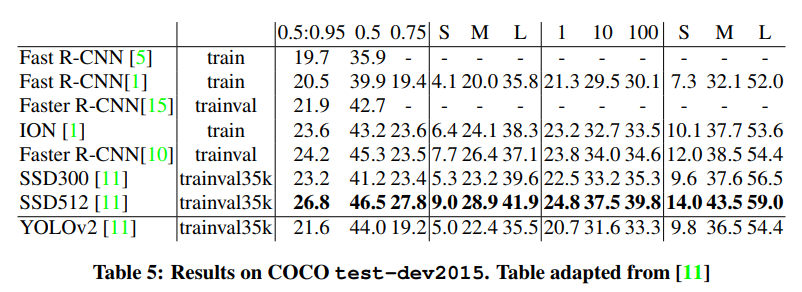

## YOLO
### YOLOv1
[paper](https://arxiv.org/pdf/1506.02640.pdf)  
[code](http://pjreddie.com/yolo/)  

---
#### STRUCTURE
  

---
#### Experimental Results
* PASCAL VOC2012 test

---
#### Algorithm
* 输出纬度 S * S * (C + B * (4 + 1))  
其中S为输出网格大小，C为目标类别数量，B为在单元网格被预测的框个数，1为当前预测框的置信度。
可理解为网络将图像划分为S * S个网格，然后在每个单元网格去预测B个框位置，每个框预测都包含了xywh四个位置信息以及是否存在目标的置信度。
且同一个网格单元的预测框共享类别预测信息。这也导致了YOLO的局限性，多个预测框有且只能有一个类别，对边界框的预测施加了强大的空间约束。
* 损失函数  
  
总的来说，网络输出和样本标签的各项内容的误差平方和作为一个样本的整体误差。
公式1、2行表示框预测误差，目标中心点单元网格的预测框只有IOU比较大的bounding box的数据才会计入误差，
且由于不同大小的对象对差值的敏感程度不同，所以在宽度和高度上取平方根来较低这种敏感度。
公式3、4行表示置信度误差，对于预测框内无对象的置信度误差加了一个权重项。
公式5行表示对象分类误差，只有有对象的网格才计入误差。
* 目标框编解码  
目标框(x, y, w, h)，其中x, y表示目标框中心相对单元网格的边界的距离。w, h则是相对于图像宽高的比值。
* 网络预测  
在预测阶段，最后一个目标可能会被多个网格预测出来，所以通过[NMS](../../../../Algorithm/NMS.md)再做筛选。

---
#### Intuition
You Only Look Once，人们看了一眼图像，立即知道图像中有什么对象，它们在哪里以及它们如何相互作用。
YOLO将候选区和对象识别这两个阶段合二为一，旨在可以进行实时的目标检测。

---
--- 
### YOLOv2
[paper](https://arxiv.org/pdf/1612.08242.pdf)  
[code](http://pjreddie.com/yolo9000/) 

---
#### STRUCTURE
  

---
#### Experimental Results
* PASCAL VOC 2007  

* PASCAL VOC2012 test  

* COCO test-dev2015  

---
#### Algorithm  
* Better  
1.Batch Normalization  
相当于一种正则化手段，提高网络收敛性，更快收敛，最终使得mAP提高2%，而且使得模型的泛化能力更强。  
2.High resolution classifier  
输入尺寸更大的图片224->448，并且将backbone在Imagenet上进行微调，最终使得mAP提高4%。  
3.Convolution with anchor boxes  
YOLOv1使用全连接层直接预测Bounding Boxes的坐标值，借鉴Faster R-CNN的RPN网络，通过预测Anchor Box的
坐标偏移量来简化检测问题。使用416尺寸的输入图像，最终输出13x13的特征图，再在特征图上做Anchor Box的
框回归和类别分类，使用anchor后mAP降低了0.3，但是能够预测出大于一千的预测框，相对于YOLOv1的98个预测框
提高了召回率7%。  
4.Dimension clusters  
Faster R-CNN中使用的Anchor Box都是手动选择的，YOLOv2通过聚类的方式选取出预选框，
其与ground truth的匹配效果优于默认的anchor。  
5.Direct location prediction  
YOLOv2还是像YOLOv1一样，预测框坐标是与网格相关的。假设一个网格的大小是1，
只要在预测框x,y坐标输出之前加一个sigmoid即可让比例在0-1之间，从而让框的中心点限制在一个网格中。  
  
使用聚类Dimension clusters和直接位置预测Direct location prediction的方法，
使YOLO比其他使用Anchor Box的版本提高了近5％。（这里的之所以还是直接位置预测是因为之前的聚类只对
宽高做了一个预选，而v1是直接做的相对于整图宽高做的预测）  
6.Fine-Grained Features  
SSD通过多尺度的特征图来进行预测获取不同的分辨率，YOLOv2仅仅在26x26的特征层上添加了一个passthrough层。
这使 26×26×512 特征层变成 13×13×2048，然后就可以堆叠到后一层特征图上了。  
  
7.Multi-Scale Training  
用不同尺寸的图片训练，区别于之前固定图片尺寸的做法，YOLOv2 每迭代几次都会改变网络，修改最后检测层的处理。
每10个Batch，网络会随机地选择一个新的图片尺寸。由于使用了下采样参数是32，所以不同的尺寸大小也选择为32的倍数
{320，352…..608}（分别是10，11...19倍），最小320×320，最大608×608，网络会自动改变尺寸，并继续训练的过程。  

* Faster  
1.Darknet-19  
  
2.Training for classification预训练  
通过ImageNet1000上进行预训练  
3.Training for detection微调训练  
保证主干网络的权重修改最后一层，新增3个3×3×1024的卷积，再加一个1×1卷积，还加了一个passthrouth层。

* Stronger  
通过WordTree的概念，获得更多的数据来源和数据纬度。  

---
#### Intuition
对YOLO的改进，Better，Faster，Stronger

---
---
### YOLOv3
[paper](https://arxiv.org/pdf/1804.02767.pdf)  
[code](https://pjreddie.com/yolo/) 

---
#### STRUCTURE
  

---
#### Experimental Results
* COCO test-dev2015  

---
#### Algorithm  
* backbone修改为darknet-53  
  
* 类FPN结构  
  
类似SSD的结构，在三个不同尺度的特征图上进行预测  
* 替换Softmax  
分类器Softmax层被替换为一个1x1卷积层＋logistic激活函数的结构，使用Softmax层已经假设输出只对应单个class,但是某些class存在重叠的情况
(例如woman和person的数据集中)，使用Softmax不能对该类数据进行较好的拟合。  

---
#### Intuition  
使用类FPN结构网络，对于小目标等困难目标有更好的检测效果，且在不同特征尺度上进行预测(类似SSD的head部分)，使得小目标可以在较大的特征图上进行预测，
由于网络更加复杂，所有整体耗时上相比v2有所增加。  

--- 
--- 
### YOLOv4  
[paper](https://arxiv.org/pdf/2004.10934.pdf)  
[code](https://github.com/AlexeyAB/darknet)  

---  
#### STRUCTURE  
  

---  
#### Experimental Results  
* COCO test-dev2017  
  

---  
#### Algorithm  
* backbone修改为CSPDarknet53  
