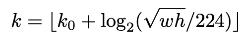

## Feature Pyramid Networks for Object Detection
[paper](https://arxiv.org/abs/1612.03144.pdf)  
[code](https://github.com/BigcowPeking/FPN)  

---
### STRUCTURE

---
### Experimental Results
* COCO Detection  
  
* COCO Instance Segmentation  

---
### Algorithm
* 特征金字塔自顶向下的路径和横向连接  
  
论文主要将二阶段检测网络中的RPN网络应用上特征金字塔网络，卷积网络从低级特征到高级特征的提取
刚好满足FPN的金字塔结构特征，可以很好的和FPN网络想结合。    
FPN在做提议框时则时在不同的层级上分配不同的anchor尺寸。  
对于RPN网络中不同尺度的ROI对应FPN不同尺度的层输出，将ROI分配到特征金字塔的级别P_k上：  
  
其中k0为总层级数，224为输入图像的尺寸，根据实际输入改变。  
对应不同层级后的ROI就可以根据该层的提议框计算损失。

---
### Intuition
FPN对于小目标有更好的性能，在检测任务中若存在小目标检测苦难的情况可以考虑使用FPN来提高小目标的检测性能。