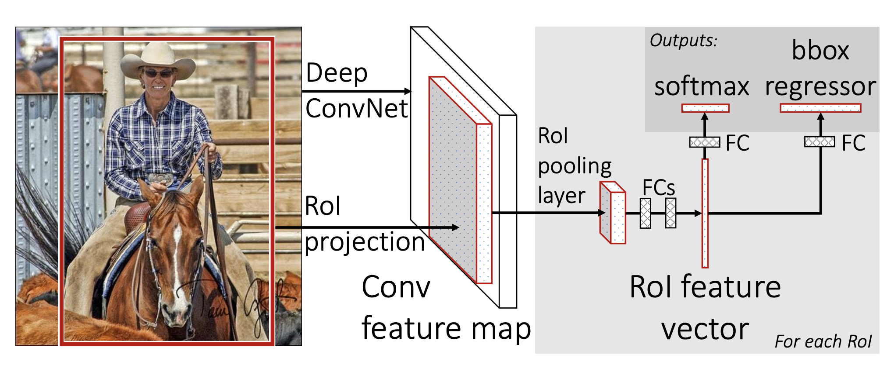
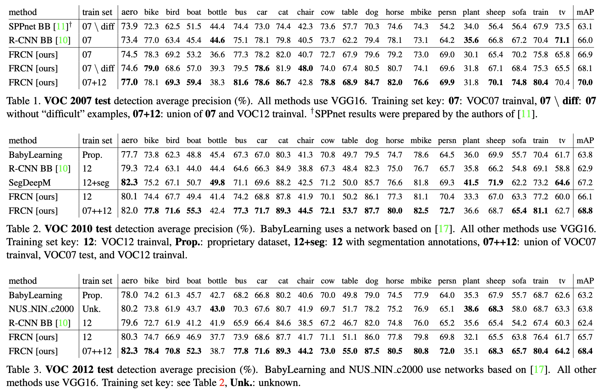
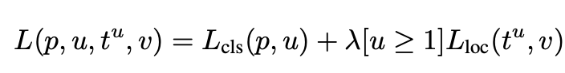
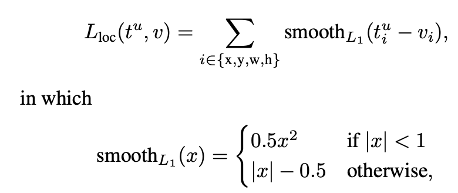

## Fast R-CNN
[paper](http://arxiv.org/pdf/1504.08083v2.pdf)  
[code](https://github.com/rbgirshick/fast-rcnn)  

---
### STRUCTURE

---
### Experimental Results
* VOC  

---
### Algorithm
* ROI池化层  
RoI max pooling通过将RoI窗口分成网格和近似大小为的子窗口，
然后将每个子窗口中的值最大化为相应的输出网格单元格。
RoI层仅仅是SPPnets中使用的空间金字塔池化层的特例，其中只有一个金字塔层级。  
* Multi-task loss  
Fast R-CNN优化了SVM的分类阶段，转而使用检测和分类两个分支分别做提议框的位置线性回归和类别的分类。
这样做也使得网络实现了端到端的前向和反向传播。  
  
同时相较于RCNN，本论文提出回归loss使用L1 loss  
  
因为L2损失的训练可能需要仔细调整学习速率，L1 loss则防止了爆炸梯度  
经过实验验证，多任务的策略不仅带来了单模型分类精度也提高了检测的mAP。

---
### Intuition
通过多任务的方式将目标检测和分类整合到了同一个网络，为后续的检测网络演化提供了很好的思路，并且端到端网络
设计理念带来了训练和测试速度上的很大提升。