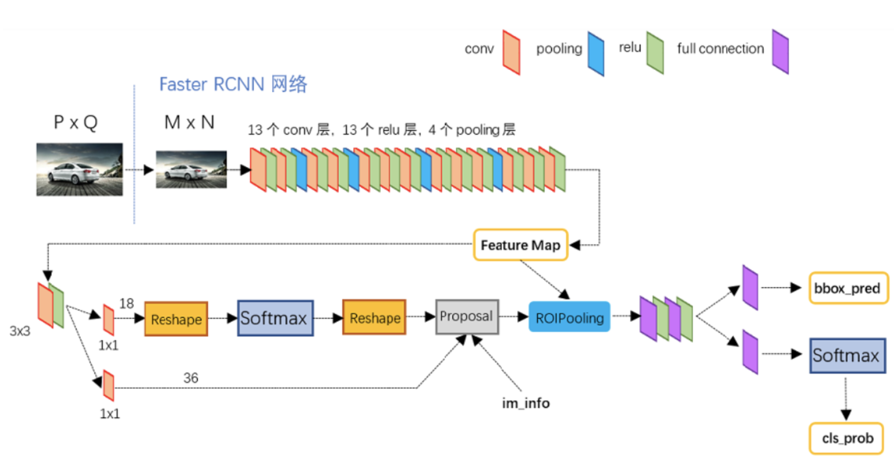
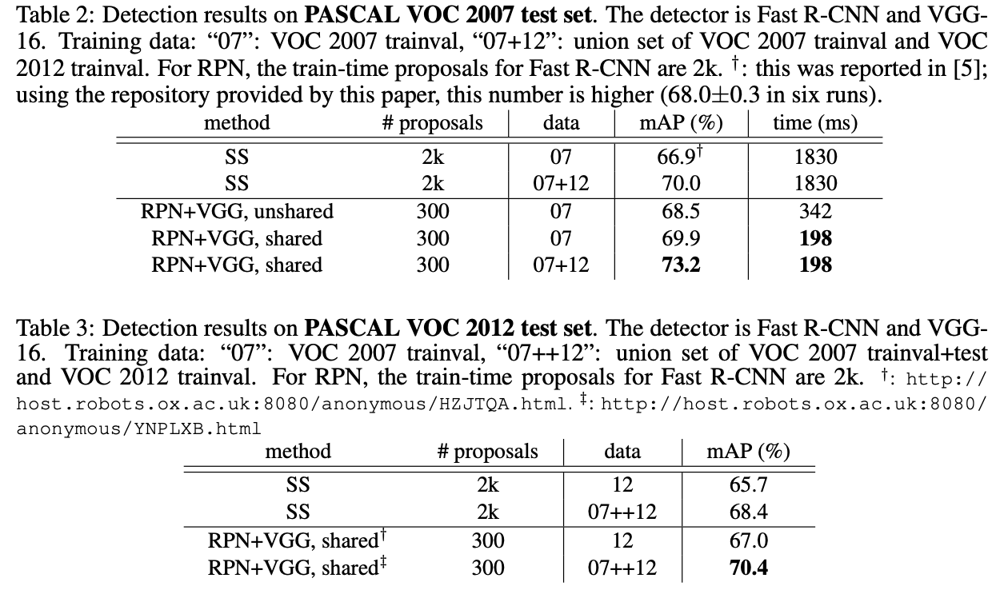
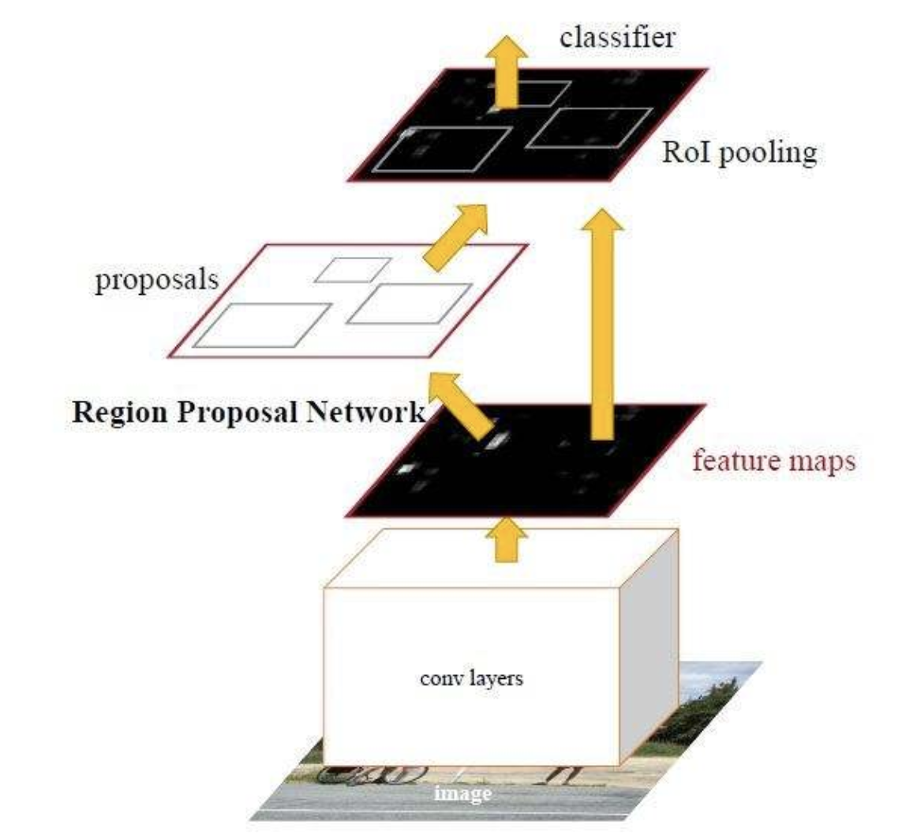
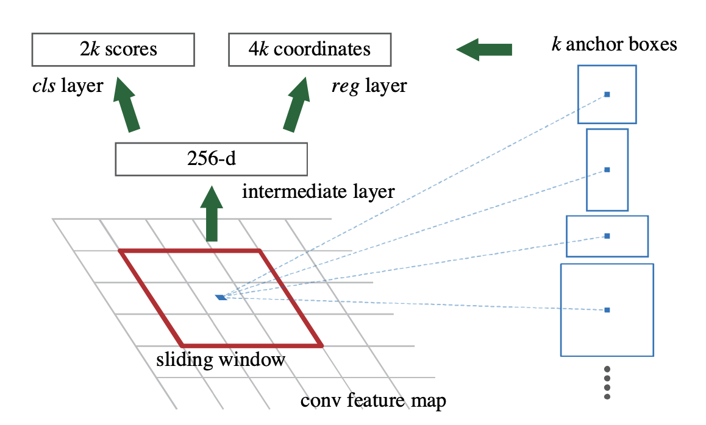
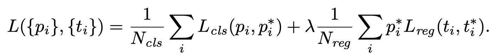

## Faster R-CNN
[paper](https://arxiv.org/pdf/1506.01497.pdf)  
[code](https://github.com/ShaoqingRen/faster_rcnn)  

---
### STRUCTURE

---
### Experimental Results
* VOC  

---
### Algorithm
* RPN网络  
  
Faster RCNN实质是RPN + Fast RCNN  
Fast RCNN和SPPNet中主要性能瓶颈在推荐区域的提取，RPN则代替了Fast RCNN 中的ss，
和分类网络共享CNN特征提取网络。  
RPN网络通过回归默认锚点来学习位置偏差  
  
RPN loss function:  
  
类别分类背景和前景两个类别，所以输出是2k，通过IOU来做类别区分，预测框和实际框IOU大于0.7和
与实际框IOU最大的预测框就作为正类，小于0.3就作为负类，其余的样本不参与训练。  
框回归的计算方式和RCNN的编解码方式相同，只是相对于默认的anchor做计算。  
anchor的设置则由于没有金字塔结构的网络的情况下，每个为孩子都会产生多尺度多宽高比的anchor。  
* 训练方式  
RPN + fast RCNN  
1.交替训练，首先训练RPN，并使用这些提议来训练Fast R-CNN  
2.近似联合训练，RPN和Fast R-CNN网络在训练期间合并成一个网络  
3.非近似的联合训练

---
### Intuition
通过RPN网络，实现了two-stage端到端的训练和实现，充分共享了底层卷积特征，是两阶段网络的一个里程碑模型。